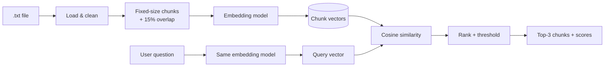

# Semantic Search Pipeline for RAG

**Chunking → Vectorization → Cosine Similarity Search**


A Python pipeline that turns a plain text document into a searchable knowledge base. It splits the text into overlapping chunks, converts each chunk into a dense vector with an embedding model, and answers natural-language questions by ranking the chunks with cosine similarity. This is the **retrieval** stage of a Retrieval-Augmented Generation (RAG) system.

> 🎓 Developed as part of the **Generative AI Solutions Development** training program (دورة تطوير حلول الذكاء الاصطناعي التوليدي), Assignment 1.

---

## Contents
- [Features](#features)
- [How it works](#how-it-works)
- [Quick start](#quick-start)
- [Usage](#usage)
- [Configuration](#configuration)
- [Results](#results)
- [Project structure](#project-structure)
- [Documentation](#documentation)
- [Development](#development)
- [Limitations and next steps](#limitations-and-next-steps)
- [ملخص بالعربية](#ملخص-بالعربية)
- [License](#license)

## Features

- 📄 **Text loading**: reads any `.txt` file and checks it has at least 10 paragraphs
- ✂️ **Fixed-size window chunking** by characters or tokens, with a **10–20% sliding overlap** so context isn't lost at boundaries
- 🔢 **Dense embeddings** with [Sentence-Transformers](https://www.sbert.net/) (default `BAAI/bge-small-en-v1.5`, 384 dimensions)
- 📐 **Cosine similarity** implemented explicitly: `(A · B) / (‖A‖ × ‖B‖)`
- 🏆 **Top-3 ranking** with similarity scores, printed as *Question → Answers*
- 🚫 **Confidence threshold**: says *"This is not in the document you provided"* instead of returning irrelevant chunks
- 📊 **Visualisations**: per-chunk similarity bar chart and a similarity matrix
- ✅ **Unit-tested** core logic with continuous integration on GitHub Actions

## How it works



| Step | What happens |
|---|---|
| 1. Load | Read the text file and normalise whitespace |
| 2. Chunk | Slide an 800-character window over the text, moving 680 characters each time (15% overlap = 120 shared characters) |
| 3. Embed | Convert every chunk into a 384-number vector |
| 4. Query | Accept a question in plain text |
| 5. Embed query | Convert the question with **the same model** |
| 6. Compare | Cosine similarity between the question and every chunk |
| 7. Rank | Sort by score and return the top 3 above the confidence threshold |

## Quick start

### Option A: Google Colab (no installation)

1. Open [Google Colab](https://colab.research.google.com/) and upload [`notebooks/semantic_search_colab.ipynb`](notebooks/semantic_search_colab.ipynb) (**File → Upload notebook**).
2. Upload your text file, or [`data/sample_football_clubs.txt`](data/sample_football_clubs.txt), in the **Files** panel.
3. Set `FILE_PATH` in the **Settings** cell and choose **Runtime → Run all**.
4. Type your question when prompted.

### Option B: Run locally

```bash
git clone https://github.com/nxull9/semantic-search-rag-pipeline.git
cd semantic-search-rag-pipeline
python -m venv .venv && source .venv/bin/activate      # Windows: .venv\Scripts\activate
pip install -r requirements.txt
```

The embedding model (~130 MB) downloads automatically on first use.

## Usage

**Ask one question:**

```bash
python src/semantic_search.py --file data/sample_football_clubs.txt --query "how many saudi clubs do we have"
```

```text
Loaded 10 paragraphs -> 8 chunks (800 characters, overlap 120 = 15%), model BAAI/bge-small-en-v1.5

================================================================================
Question: how many saudi clubs do we have
================================================================================
Answers (3 chunk(s) with similarity ≥ 0.6):

1. Chunk 0 | Similarity score: 0.7366
   Al Hilal is a professional football club based in the capital Riyadh, Saudi Arabia...

2. Chunk 1 | Similarity score: 0.7234
   ...Al Nassr became famous around the world in January 2023 when Cristiano Ronaldo joined...
   ...Al Ittihad is a football club from the coastal city of Jeddah and was founded in 1927...

3. Chunk 4 | Similarity score: 0.6881
   ...
```

**A question the document can't answer:**

```bash
python src/semantic_search.py --file data/sample_football_clubs.txt --query "What is the capital of France?"
```

```text
Question: What is the capital of France?
❌ This is not in the document you provided (no chunk scored ≥ 0.6).
```

**Interactive mode** (ask several questions, press Enter on an empty line to quit):

```bash
python src/semantic_search.py --file data/sample_football_clubs.txt
```

**Use it from Python:**

```python
from semantic_search import load_text, chunk_text, SemanticSearch

text, paragraphs = load_text("data/sample_football_clubs.txt")
chunks = chunk_text(text, chunk_size=800, overlap_percent=15)
engine = SemanticSearch(chunks)

for result in engine.search("Which club signed Karim Benzema?", top_k=3, min_score=0.6):
    print(result.rank, result.chunk_id, round(result.score, 4), result.text[:80])
```

## Configuration

| Parameter | CLI flag | Default | Description |
|---|---|---|---|
| `CHUNK_SIZE` | `--chunk-size` | `800` | Size of each chunk, in characters or tokens |
| `OVERLAP_PERCENT` | `--overlap` | `15` | Overlap between neighbouring chunks, from 10 to 20% |
| `CHUNK_UNIT` | `--unit` | `characters` | `characters` or `tokens` |
| `EMBEDDING_MODEL` | `--model` | `BAAI/bge-small-en-v1.5` | Any Sentence-Transformers model |
| `TOP_K` | `--top-k` | `3` | Maximum number of chunks returned |
| `MIN_SCORE` | `--min-score` | `0.6` | Minimum cosine similarity for a chunk to be returned |

In the notebook, these are all in the **Settings** cell. See the [technical documentation](docs/TECHNICAL_DOCUMENTATION.md#7-parameters) for what each one changes.

## Results

Main findings from the [experiments](docs/EXPERIMENTS.md):

- **Chunk size controls the trade-off between precision and coverage.** With 500-character chunks, a broad question ("how many Saudi clubs…") missed one of three clubs; with 800-character chunks all three were found in the top 3.
- **Smaller chunks match specific questions more strongly** (average best score 0.79 at 200 characters, 0.67 at 800), because a small chunk is about one thing.
- **A threshold of 0.6 rejects off-topic questions.** Unrelated questions score 0.36–0.53. The hardest cases are same-topic questions the text doesn't answer.

<p align="center">
  
  
</p>

## Project structure

```
semantic-search-rag-pipeline/
├── src/
│   └── semantic_search.py          # Pipeline: loading, chunking, embedding, cosine search, CLI
├── notebooks/
│   └── semantic_search_colab.ipynb # Step-by-step Colab notebook with charts
├── data/
│   └── sample_football_clubs.txt   # Sample input: 10 paragraphs
├── scripts/
│   └── run_experiments.py          # Reproduces docs/EXPERIMENTS.md
├── tests/
│   └── test_pipeline.py            # Unit tests (pytest)
├── docs/
│   ├── TECHNICAL_DOCUMENTATION.md  # Architecture, algorithms, parameters
│   ├── EXPERIMENTS.md              # Chunk size, overlap and threshold experiments
│   └── images/                     # Charts used in the docs
├── .github/workflows/tests.yml     # CI: runs the tests on every push / PR
├── requirements.txt
├── requirements-dev.txt
├── CHANGELOG.md
├── CONTRIBUTING.md
└── LICENSE
```

## Documentation

- 📘 [Technical documentation](docs/TECHNICAL_DOCUMENTATION.md): architecture, chunking maths, cosine similarity, parameters, code reference, limitations
- 🧪 [Experiments](docs/EXPERIMENTS.md): how chunk size, overlap and the threshold affect results
- 📝 [Changelog](CHANGELOG.md): version history
- 🤝 [Contributing](CONTRIBUTING.md): branching, commit conventions and how to submit changes

## Development

```bash
pip install -r requirements-dev.txt
pytest                                 # run the test suite
python scripts/run_experiments.py      # regenerate the experiment results and charts
```

The project follows [Conventional Commits](https://www.conventionalcommits.org/) and [Semantic Versioning](https://semver.org/). Releases are tagged (`v1.0.0`) and recorded in the [changelog](CHANGELOG.md).

## Limitations and next steps

- Retrieval only: it returns passages, not a generated answer. **Next step:** pass the top chunks to an LLM to write the answer (the generation part of RAG).
- Top-k similarity is not exhaustive, so "list all…" questions may need larger chunks or a higher `TOP_K`. **Next step:** add a cross-encoder re-ranker or hybrid keyword (BM25) search.
- The default model is English-only. **Next step:** support Arabic with a multilingual model such as `BAAI/bge-m3`.
- `MIN_SCORE` is calibrated for one model; other models need re-calibration.

## ملخص بالعربية

مشروع ضمن **دورة تطوير حلول الذكاء الاصطناعي التوليدي** (الواجب الأول)، يبني المرحلة الأولى من أنظمة **التوليد المعزز بالاسترجاع (RAG)**:

1. **تحميل** ملف نصي يحتوي على ١٠ فقرات على الأقل.
2. **تقسيم النص (Chunking)** إلى أجزاء ثابتة الحجم (حروف أو رموز) مع **تداخل ١٠–٢٠٪** بين الأجزاء المتجاورة حتى لا يضيع السياق عند الحدود.
3. **تحويل كل جزء إلى متجه رقمي (Embedding)** باستخدام نموذج تضمين.
4. **استقبال سؤال المستخدم** وتحويله إلى متجه بنفس النموذج.
5. **حساب التشابه (Cosine Similarity)** بين السؤال وجميع الأجزاء.
6. **ترتيب النتائج** وعرض أفضل ٣ أجزاء مع درجات التشابه، أو إظهار رسالة بأن الإجابة غير موجودة في المستند إذا كانت الدرجات أقل من الحد الأدنى.

**طريقة التشغيل:** ارفع الدفتر `notebooks/semantic_search_colab.ipynb` إلى Google Colab مع ملفك النصي ثم شغّل جميع الخلايا، أو استخدم الأمر في قسم [Usage](#usage).

## License

Released under the [MIT License](LICENSE).
