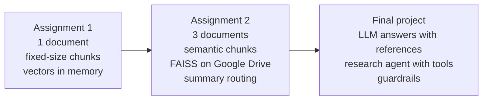

# Generative AI Solutions Development: Course Projects

[](https://github.com/SDAIAAcademy)


Projects completed as part of the **Generative AI Solutions Development** training program (دورة تطوير حلول الذكاء الاصطناعي التوليدي) at **[SDAIA Academy](https://github.com/SDAIAAcademy)**.

The projects build a Retrieval-Augmented Generation (RAG) system step by step: turning documents into searchable vectors, finding the passages that answer a question, and finally having an LLM and a research agent write the answer from those passages. Each project is self-contained in its own folder, with its notebook (as `.ipynb` and `.py`), data, documentation and results.

## Projects

| # | Project | What it does | Key techniques | Status |
|---|---|---|---|---|
| 1 | [Semantic Search Pipeline](assignment-1-semantic-search/) | Splits one document into chunks, embeds them, and answers questions with the top 3 most similar chunks | Fixed-size chunking with 15% overlap, sentence embeddings, cosine similarity | Completed |
| 2 | [Semantic Chunking and a FAISS Vector Database](assignment-2-semantic-faiss/) | Indexes three documents from different fields in a saved vector database, and answers questions with the top 3 chunks and their source file | Semantic chunking, FAISS, persistent storage on Google Drive, summary-based routing, step-by-step verification | Completed |
| 3 | [Final Project: RAG Pipeline with a Research Agent](final-project-rag-agent/) | Adds generation to Assignment 2: an LLM answers from the top 3 chunks with references, and a ReAct agent searches and calculates to answer questions that need several facts | LLM via OpenRouter, prompt templates, function calling, ReAct agent, guardrails | Completed |

## How the projects build on each other



| | Assignment 1 | Assignment 2 | Final project |
|---|---|---|---|
| Documents | 1 | 3, from different fields | 3, from different fields |
| Chunking | Fixed size (800 characters) with 15% overlap | Semantic: by paragraph and by changes in meaning | Same as Assignment 2 |
| Storage | In memory, rebuilt on every run | FAISS index saved to Google Drive and reused | Same as Assignment 2 |
| Search | Cosine similarity over one document | Cosine similarity over all documents, or summaries first to select the document | Same, called once per question or by the agent as a tool |
| Output | Top 3 chunks with scores | Top 3 chunks with scores and source file | An LLM-written answer with the files and chunks it used |
| Reasoning | None | None | ReAct agent with a search tool and a calculator |
| Safety and checks | Overlap check | 27 automated checks across every step | Step limit, allowed tools, safe calculator, source check |

## Technology

| Area | Tools |
|---|---|
| Language and environment | Python, Google Colab |
| Embeddings | Sentence-Transformers, `BAAI/bge-small-en-v1.5` (384 dimensions) |
| Vector search | NumPy cosine similarity (Assignment 1), FAISS `IndexFlatIP` (Assignment 2 and final project) |
| LLM | `google/gemini-2.5-flash` through the OpenRouter API, called with `requests` |
| Agent | ReAct loop with function calling, written in plain Python |
| Data handling | pandas, JSON |
| Visualisation | Matplotlib |

## Repository structure

```
semantic-search-rag-pipeline/
├── assignment-1-semantic-search/   # Project 1: fixed-size chunking and cosine similarity search
│   ├── notebooks/
│   ├── data/
│   ├── docs/
│   └── README.md
├── assignment-2-semantic-faiss/    # Project 2: semantic chunking, FAISS vector database, summary routing
│   ├── notebooks/
│   ├── data/
│   ├── docs/
│   └── README.md
├── final-project-rag-agent/        # Final project: LLM answers, research agent, guardrails
│   ├── notebooks/
│   ├── data/
│   ├── docs/
│   └── README.md
├── CHANGELOG.md
├── CONTRIBUTING.md
├── LICENSE
└── README.md
```

## Running a project

All projects are Google Colab notebooks and need no local installation. Each `notebooks/` folder has the notebook (`.ipynb`) and the same code as a Python file (`.py`).

1. Open the project's folder and read its README.
2. Upload the notebook from its `notebooks/` folder to [Google Colab](https://colab.research.google.com/).
3. Upload the files from its `data/` folder to the Colab Files panel.
4. For the final project, add an OpenRouter API key to Colab Secrets as `OPENROUTER_API_KEY`.
5. Run all cells.

## About the program

The Generative AI Solutions Development program at [SDAIA Academy](https://github.com/SDAIAAcademy) covers the design and development of generative AI applications. These projects are the course's practical assignments, published and versioned on GitHub as part of the program requirements.

## Arabic summary

يضم هذا المستودع مشاريعي في دورة **تطوير حلول الذكاء الاصطناعي التوليدي** في **[أكاديمية سدايا](https://github.com/SDAIAAcademy)**. أنجزت ثلاثة مشاريع:

1. **خط معالجة للبحث الدلالي:** تقسيم مستند واحد إلى أجزاء ثابتة الحجم مع تداخل، وتحويلها إلى متجهات، والإجابة عن الأسئلة بأفضل ثلاثة أجزاء باستخدام تشابه جيب التمام.
2. **التقسيم الدلالي وقاعدة بيانات المتجهات FAISS:** فهرسة ثلاثة مستندات من مجالات مختلفة في قاعدة بيانات متجهات محفوظة على Google Drive، مع ملخص لكل مستند لاختيار المستند المناسب قبل البحث، وعرض أفضل ثلاثة أجزاء مع اسم الملف المصدر.
3. **المشروع النهائي، نظام RAG مع وكيل بحثي:** إرسال أفضل ثلاثة أجزاء مع السؤال إلى نموذج لغوي عبر OpenRouter ليكتب الإجابة منها فقط مع ذكر المراجع، ووكيل بنمط ReAct يستخدم أداتي البحث والآلة الحاسبة للإجابة عن الأسئلة التي تحتاج أكثر من معلومة، ضمن ضوابط أمان.

## License

Released under the [MIT License](LICENSE).
