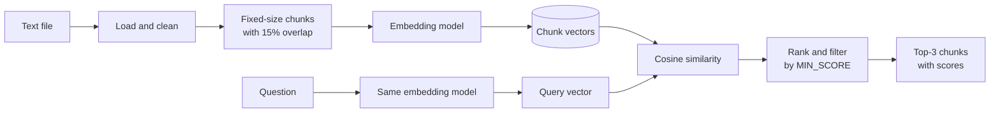
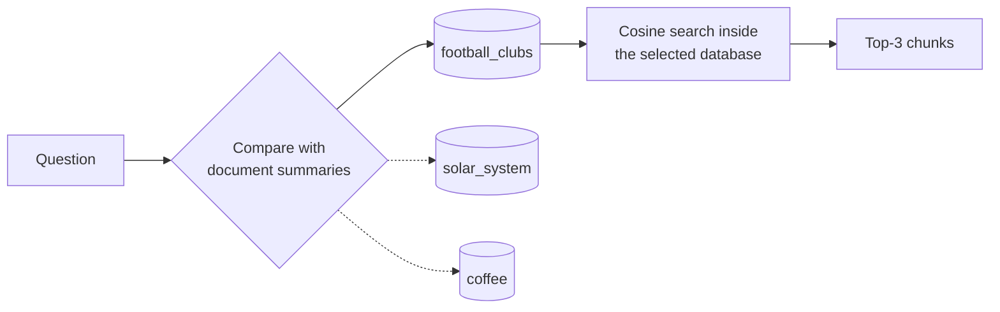
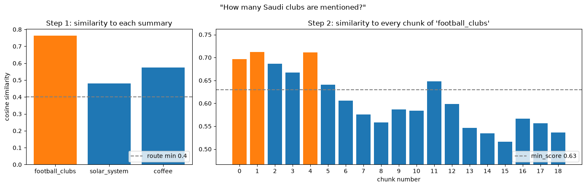
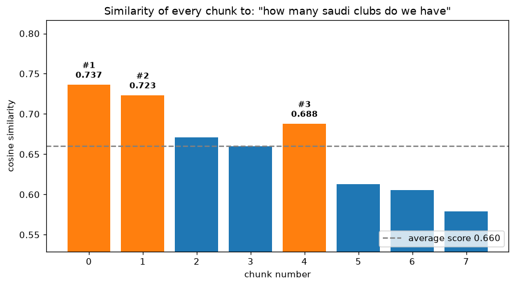
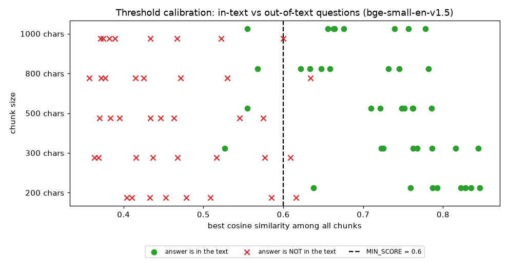

# Semantic Search Pipeline for RAG

[](https://github.com/nxull9/semantic-search-rag-pipeline/actions/workflows/tests.yml)


A lightweight retrieval pipeline that turns any plain-text document into a searchable knowledge base. The text is split into overlapping fixed-size chunks, each chunk is embedded with a sentence-embedding model, and questions are answered by ranking chunks with cosine similarity. When nothing in the document is relevant enough, the pipeline says so instead of returning unrelated text.

This is the retrieval stage of a Retrieval-Augmented Generation (RAG) system: the component that decides which parts of a document an LLM should read before answering.

The project has two parts:

| Part | What it does | Entry points |
|---|---|---|
| **Single-document search** | Chunk, embed and search one document | `src/semantic_search.py`, `notebooks/semantic_search_colab.ipynb` |
| **Multi-document routing** | Keep one tuned vector database per document, pick the right document by comparing the question with document summaries, then search inside it | `src/multi_document.py`, `notebooks/multi_document_routing_colab.ipynb` |

Built as part of the **Generative AI Solutions Development** training program (Assignments 1 and 2).

## Contents

- [How it works](#how-it-works)
- [Multi-document routing](#multi-document-routing)
- [Getting started](#getting-started)
- [Usage](#usage)
- [Configuration](#configuration)
- [Using your own documents](#using-your-own-documents)
- [Results](#results)
- [Design decisions](#design-decisions)
- [Project structure](#project-structure)
- [Testing](#testing)
- [Limitations and roadmap](#limitations-and-roadmap)
- [Arabic summary](#arabic-summary)
- [License](#license)

## How it works



1. **Load** a `.txt` file and normalise whitespace. The file should contain at least 10 paragraphs.
2. **Chunk** the text with a sliding window. With the defaults, each chunk is 800 characters and the window moves 680 characters at a time, so neighbouring chunks share 120 characters (15%). The overlap keeps sentences that fall on a boundary intact in at least one chunk.
3. **Embed** every chunk into a 384-dimensional vector with `BAAI/bge-small-en-v1.5`.
4. **Embed the question** with the same model, so questions and chunks live in the same vector space.
5. **Score** every chunk with cosine similarity: `(A · B) / (‖A‖ × ‖B‖)`.
6. **Rank** the chunks and return the top 3 that score at least `MIN_SCORE` (default 0.6). If none qualify, the question is reported as not covered by the document.

The full derivation of each step is in the [technical documentation](docs/TECHNICAL_DOCUMENTATION.md).

## Multi-document routing

When there are several documents on different subjects, searching all of their chunks at once mixes unrelated results and wastes computation. The routing extension handles this in two stages:



1. **Route:** embed the question and compare it with a short summary of each document. The best-matching document is selected.
2. **Retrieve:** search only that document's vector database and return the top 3 chunks above its minimum score. If none qualify, the second-best document is tried before the answer is reported as not found.

Each document has its own vector database, with settings tuned by testing it on questions it should and should not answer:

| Collection | Subject | Chunk size | Overlap | `min_score` | Reason |
|---|---|---|---|---|---|
| `football_clubs` | Ten football clubs | 300 | 10% | 0.63 | Short facts, so small chunks match sharply |
| `solar_system` | The Sun, planets and space missions | 300 | 10% | 0.66 | One numeric fact per sentence |
| `coffee` | Coffee history, farming, brewing, Arabic coffee | 800 | 10% | 0.67 | Explanations span several sentences |

On the evaluation set, all 24 answerable questions were routed to the correct document, and questions outside all three subjects were rejected. The main finding is that **summaries are reliable for choosing between documents, but the decision on whether an answer exists has to be made at chunk level**, where the evidence is specific. Full method and results are in [MULTI_DOCUMENT_ROUTING.md](docs/MULTI_DOCUMENT_ROUTING.md).

```bash
python src/multi_document.py --query "Which planet is the hottest?"
```

```text
Routing (similarity to each document summary):
  solar_system       0.6773  <- selected
  coffee             0.4782
  football_clubs     0.4356

Answers from 'solar_system' (3 chunk(s)):

1. Chunk 4 | Similarity score: 0.8166
   ...Venus is the hottest planet, even though Mercury is closer to the Sun. Its thick atmosphere of carbon dioxide traps heat...
```

<p align="center">
  
</p>

## Getting started

### Requirements

- Python 3.10 or newer
- About 150 MB of disk space for the embedding model, which downloads automatically on first run

### Installation

```bash
git clone https://github.com/nxull9/semantic-search-rag-pipeline.git
cd semantic-search-rag-pipeline
python -m venv .venv
source .venv/bin/activate          # Windows: .venv\Scripts\activate
pip install -r requirements.txt
```

### Google Colab

No local setup is needed to run the notebook version:

1. Open [Google Colab](https://colab.research.google.com/) and upload `notebooks/semantic_search_colab.ipynb` (File > Upload notebook).
2. Upload your text file, or `data/sample_football_clubs.txt`, to the Files panel.
3. Set `FILE_PATH` in the Settings cell and run all cells.

The notebook walks through each step separately and includes a per-chunk similarity chart and a similarity matrix.

For the multi-document version, upload `notebooks/multi_document_routing_colab.ipynb` together with the three documents in `data/` and the three summary files in `data/summaries/`.

## Usage

### Command line

Ask a single question:

```bash
python src/semantic_search.py --file data/sample_football_clubs.txt --query "How many Saudi clubs are mentioned?"
```

```text
Loaded 10 paragraphs -> 8 chunks (800 characters, overlap 120 = 15%), model BAAI/bge-small-en-v1.5

================================================================================
Question: How many Saudi clubs are mentioned?
================================================================================
Answers (3 chunk(s) with similarity >= 0.6):

1. Chunk 0 | Similarity score: 0.6993
   Al Hilal is a professional football club based in the capital Riyadh, Saudi Arabia...

2. Chunk 1 | Similarity score: 0.6737
   ...Al Nassr became famous around the world in January 2023... Al Ittihad is a football club from the coastal city of Jeddah...

3. Chunk 4 | Similarity score: 0.6221
   ...
```

A question the document does not cover:

```bash
python src/semantic_search.py --file data/sample_football_clubs.txt --query "What is the capital of France?"
```

```text
Question: What is the capital of France?
Not found: this is not in the document you provided (no chunk scored >= 0.6).
```

Leave out `--query` to start an interactive session, then press Enter on an empty line to exit.

### Python API

The pipeline is a small set of functions you can import into your own project:

```python
from semantic_search import load_text, chunk_text, SemanticSearch

text, paragraphs = load_text("data/sample_football_clubs.txt")
chunks = chunk_text(text, chunk_size=800, overlap_percent=15)

engine = SemanticSearch(chunks)            # embeds all chunks once
results = engine.search("Which club signed Karim Benzema?", top_k=3, min_score=0.6)

for r in results:
    print(f"{r.rank}. chunk {r.chunk_id}  score={r.score:.4f}  {r.text[:80]}...")
```

`SemanticSearch` accepts any model object with an `encode()` method, so you can plug in another embedding backend without changing the search logic.

## Configuration

| Parameter | CLI flag | Default | What it controls |
|---|---|---|---|
| `CHUNK_SIZE` | `--chunk-size` | `800` | Length of each chunk, in characters or tokens |
| `OVERLAP_PERCENT` | `--overlap` | `15` | Share of each chunk repeated in the next one (10 to 20) |
| `CHUNK_UNIT` | `--unit` | `characters` | Measure chunks in `characters` or model `tokens` |
| `EMBEDDING_MODEL` | `--model` | `BAAI/bge-small-en-v1.5` | Any Sentence-Transformers model |
| `TOP_K` | `--top-k` | `3` | Maximum number of chunks returned |
| `MIN_SCORE` | `--min-score` | `0.6` | Minimum cosine similarity for a chunk to be returned |

In the notebook, all of these live in the Settings cell.

## Using your own documents

1. **Prepare the text.** Save it as UTF-8 `.txt`, with paragraphs separated by blank lines.
2. **Pick a chunk size for the questions you expect.**
   - Specific lookups ("Who founded X?"): 200 to 500 characters give sharper matches.
   - Broad questions ("List all X", "How many Y?"): 800 to 1000 characters, or a higher `TOP_K`, so related facts land in fewer chunks.
3. **Calibrate `MIN_SCORE`.** Ask a few questions the document answers and a few it doesn't, then look at the scores. Set the threshold between the two groups. `scripts/run_experiments.py` shows how this was done for the sample data.
4. **Switch models for other languages.** The default model is English-only. For Arabic or mixed-language text, use a multilingual model such as `BAAI/bge-m3` (`--model BAAI/bge-m3`) and re-calibrate `MIN_SCORE`, because every model produces scores on a different scale.

## Results

Evaluated on the 10-paragraph sample document. Full tables are in [EXPERIMENTS.md](docs/EXPERIMENTS.md).

| Finding | Evidence |
|---|---|
| Chunk size trades precision for coverage | For a broad question, 500-character chunks found 2 of 3 relevant entities in the top 3; 800-character chunks found all 3 |
| Smaller chunks match specific questions more strongly | Average best score 0.79 at 200 characters vs 0.67 at 800 |
| A 0.6 threshold rejects off-topic questions | Unrelated questions score 0.36 to 0.53; the hardest cases are same-topic questions the text doesn't answer |

<p align="center">
  
  
</p>

## Design decisions

- **Fixed-size windows with overlap.** Simple, predictable and model-agnostic. The 15% overlap sits in the middle of the 10 to 20% range and protects facts that fall on chunk boundaries for a small storage cost.
- **800-character default chunks.** About 200 tokens, well under the model's 512-token limit, and large enough to keep related facts together for broad questions.
- **`bge-small-en-v1.5`.** A strong retrieval model at 33M parameters that runs quickly on CPU, which suits free Colab and laptops.
- **Explicit cosine similarity.** Implemented directly in NumPy rather than through a library call, so the scoring is transparent and easy to verify.
- **Confidence threshold.** Nearest-neighbour search always returns something. A calibrated minimum score turns "the closest chunk" into "a relevant chunk or nothing".

## Project structure

```
semantic-search-rag-pipeline/
├── src/
│   ├── semantic_search.py              # Single-document pipeline and CLI
│   └── multi_document.py               # Vector stores, summary router and CLI
├── notebooks/
│   ├── semantic_search_colab.ipynb     # Single-document walkthrough
│   └── multi_document_routing_colab.ipynb
├── config/collections.json             # Per-collection settings and router settings
├── data/
│   ├── sample_football_clubs.txt       # Documents (10+ paragraphs each)
│   ├── solar_system.txt
│   ├── coffee.txt
│   ├── summaries/                      # One routing summary per document
│   └── eval_questions.json             # Questions used for tuning and evaluation
├── scripts/
│   ├── run_experiments.py              # Reproduces docs/EXPERIMENTS.md
│   ├── tune_collections.py             # Tunes each collection and the router
│   └── build_multi_document_notebook.py
├── tests/                              # Unit tests (pytest)
├── docs/
│   ├── TECHNICAL_DOCUMENTATION.md      # Architecture, algorithms, parameters
│   ├── EXPERIMENTS.md                  # Chunk size, overlap and threshold results
│   ├── MULTI_DOCUMENT_ROUTING.md       # Routing design, tuning and results
│   └── images/
├── .github/workflows/tests.yml      # Continuous integration
├── requirements.txt
├── requirements-dev.txt
├── CHANGELOG.md
├── CONTRIBUTING.md
└── LICENSE
```

## Testing

```bash
pip install -r requirements-dev.txt
pytest
```

The tests cover paragraph loading, overlap validation, chunk sizes and boundaries, lossless reconstruction of the text from its chunks, cosine similarity against hand-computed values, ranking with the confidence threshold, and for multi-document routing: building, saving and loading vector stores, routing by summary, fallback to the next document, and the project configuration. They use a lightweight fake embedding model, so they run in under a second without downloading anything. GitHub Actions runs them on every push and pull request.

To regenerate the experiment results and re-tune the collections:

```bash
python scripts/run_experiments.py      # single-document experiments
python scripts/tune_collections.py     # per-collection settings and router threshold
```

## Limitations and roadmap

| Limitation | Planned improvement |
|---|---|
| Returns passages, not a written answer | Pass the top chunks to an LLM to generate the answer (the generation stage of RAG) |
| Top-k similarity is not exhaustive, so "list all" questions can miss items | Add a cross-encoder re-ranker and hybrid keyword (BM25) search |
| Default model is English-only | Ship a multilingual configuration with `BAAI/bge-m3` |
| `MIN_SCORE` is calibrated for one model and dataset | Add an automatic calibration step |
| Each question is answered from a single document | Merge results from several collections when a question spans subjects |
| Vector databases are simple NumPy files | Move to FAISS or Chroma for large collections |

Contributions are welcome. See [CONTRIBUTING.md](CONTRIBUTING.md) for the branching and commit conventions, and [CHANGELOG.md](CHANGELOG.md) for release history.

## Arabic summary

مشروع ضمن دورة **تطوير حلول الذكاء الاصطناعي التوليدي** (الواجبان الأول والثاني)، يمثل مرحلة الاسترجاع في أنظمة التوليد المعزز بالاسترجاع (RAG).

يقوم المشروع بتحميل ملف نصي، ثم تقسيمه إلى أجزاء ثابتة الحجم مع تداخل بنسبة ١٥٪ بين الأجزاء المتجاورة، وتحويل كل جزء إلى متجه رقمي باستخدام نموذج تضمين. عند طرح سؤال، يُحوَّل السؤال إلى متجه بالنموذج نفسه، ويُحسب تشابه جيب التمام (Cosine Similarity) بينه وبين جميع الأجزاء، ثم تُعرض أفضل ثلاثة أجزاء مع درجاتها. وإذا لم يتجاوز أي جزء الحد الأدنى للتشابه، يوضح النظام أن الإجابة غير موجودة في المستند.

كما يتضمن المشروع (الواجب الثاني) البحث في عدة مستندات بمواضيع مختلفة: كرة القدم، والمجموعة الشمسية، والقهوة. لكل مستند قاعدة بيانات متجهات خاصة به بإعدادات مضبوطة حسب محتواه، وملخص قصير. عند طرح سؤال، يُقارن أولاً بملخصات المستندات لاختيار المستند المناسب، ثم يتم البحث بالتشابه داخل قاعدة بيانات ذلك المستند فقط وعرض أفضل ثلاث نتائج.

للتشغيل: ارفع الدفتر `notebooks/semantic_search_colab.ipynb` أو `notebooks/multi_document_routing_colab.ipynb` إلى Google Colab مع الملفات النصية ثم شغّل جميع الخلايا، أو استخدم أوامر قسم [Usage](#usage).

## License

Released under the [MIT License](LICENSE).
