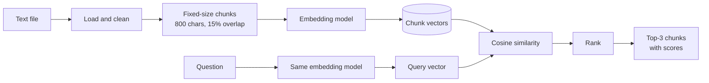

# Assignment 1: Semantic Search Pipeline for RAG


A notebook that turns a plain-text document into a searchable knowledge base. The text is split into fixed-size chunks with a sliding-window overlap, each chunk is converted into a dense vector with a sentence-embedding model, and a user's question is answered by ranking the chunks with cosine similarity and returning the top 3.

This is the retrieval stage of a Retrieval-Augmented Generation (RAG) system: the component that finds the parts of a document an LLM should read before answering.

Part of the **Generative AI Solutions Development** program at [SDAIA Academy](https://github.com/SDAIAAcademy). See the [repository overview](../README.md) for the full list of projects.

## Contents

- [How it works](#how-it-works)
- [Getting started](#getting-started)
- [Configuration](#configuration)
- [Results](#results)
- [Folder structure](#folder-structure)
- [Limitations](#limitations)
- [Arabic summary](#arabic-summary)

## How it works



| Step | Notebook cell | What happens |
|---|---|---|
| 1. Load | 3 | Read the `.txt` file, split it into paragraphs, check there are at least 10, and join them into one clean text |
| 2. Chunk | 4, 5 | Slide an 800-character window over the text, moving 680 characters each time, so neighbouring chunks share 120 characters (15%). Cell 5 prints the shared text as proof |
| 3. Embed | 6 | Convert every chunk into a 384-dimensional vector with `BAAI/bge-small-en-v1.5` |
| 4. Query | 8 | Ask the user for a question in plain text |
| 5. Embed query | 8 | Convert the question with the same model |
| 6. Compare | 7, 8 | Cosine similarity between the question and every chunk: `(A · B) / (‖A‖ × ‖B‖)` |
| 7. Rank | 8 | Sort the chunks by score and print the top 3 as Question and Answers |

A full description of every cell is in the [technical documentation](docs/TECHNICAL_DOCUMENTATION.md).

## Getting started

The notebook is written for Google Colab and needs no local installation.

1. Open [Google Colab](https://colab.research.google.com/) and upload [`notebooks/semantic_search_colab.ipynb`](notebooks/semantic_search_colab.ipynb) (File > Upload notebook).
2. Upload your text file to the Files panel. It should be UTF-8 with at least 10 paragraphs separated by blank lines. A sample is provided in [`data/sample_football_clubs.txt`](data/sample_football_clubs.txt).
3. Set `FILE_PATH` in the first cell to your file's name. If the file isn't found, the notebook shows an upload button and uses the uploaded file instead.
4. Run all cells (Runtime > Run all) and type your question when prompted.

The first run downloads the embedding model (about 130 MB).

## Configuration

All settings are in the first cell, except `MIN_SCORE`, which is defined with the search function in the last cell.

| Setting | Value | Description |
|---|---|---|
| `FILE_PATH` | `"my_text.txt"` | Name of the text file in the Colab Files panel |
| `CHUNK_UNIT` | `"characters"` | Measure chunks in `"characters"` or model `"tokens"` |
| `CHUNK_SIZE` | `800` | Length of each chunk |
| `OVERLAP_PERCENT` | `15` | Share of each chunk repeated at the start of the next one. Must be between 10 and 20 |
| `EMBEDDING_MODEL` | `"BAAI/bge-small-en-v1.5"` | Sentence-Transformers model used for both chunks and questions |
| `TOP_K` | `3` | Number of chunks returned |
| `MIN_SCORE` | `0.20` | Chunks scoring below this are not returned. If none qualify, the notebook reports that the answer is not in the document |

After changing a setting, re-run the first cell and then the cells that follow it.

## Results

Results from running the notebook on the sample document ([`data/sample_football_clubs.txt`](data/sample_football_clubs.txt)).

**Loading and chunking**

```text
Paragraphs: 10 | Characters: 5,114 | Words: 900
Chunk size: 800 characters | Overlap: 120 characters (15%) | Step: 680
Number of chunks: 8
Vectors: 8 chunks x 384 numbers each
```

Chunks 0 to 6 are 800 characters each and the last chunk holds the remaining 354. The overlap check confirms that the last 120 characters of chunk 0 are repeated at the start of chunk 1.

**Search**

| Question | Rank | Chunk | Score | Relevant content in the chunk |
|---|---|---|---|---|
| how many saudi clubs do we have | 1 | 0 | 0.7366 | Al Hilal and Al Nassr |
| | 2 | 1 | 0.7234 | Al Nassr and Al Ittihad |
| | 3 | 4 | 0.6881 | Manchester United and Liverpool (no Saudi club) |
| Which club signed Karim Benzema? | 1 | 1 | 0.6331 | "Al Ittihad signed the French striker Karim Benzema" |
| | 2 | 5 | 0.6231 | Liverpool, Bayern Munich and Juventus |
| | 3 | 0 | 0.6191 | Al Hilal and Al Nassr |
| What is the capital of France? | 1 | 3 | 0.5300 | FC Barcelona and Manchester United (not relevant) |
| | 2 | 2 | 0.5193 | Al Ittihad, Real Madrid and FC Barcelona (not relevant) |
| | 3 | 5 | 0.5057 | Liverpool, Bayern Munich and Juventus (not relevant) |

Example output:

```text
================================================================================
Question: how many saudi clubs do we have
================================================================================
Answers (3 chunk(s) with similarity ≥ 0.2):

1. Chunk 0 | Similarity score: 0.7366
   Al Hilal is a professional football club based in the capital Riyadh, Saudi Arabia...

2. Chunk 1 | Similarity score: 0.7234
   ...Al Nassr became famous around the world in January 2023 when Cristiano Ronaldo joined the club...
   Al Ittihad is a football club from the coastal city of Jeddah and was founded in 1927...
```

**Observations**

- The two questions answered by the document rank the correct chunks first. All three Saudi clubs (Al Hilal, Al Nassr, Al Ittihad) appear in the top two chunks, because 800-character chunks keep neighbouring paragraphs together.
- Relevant chunks score clearly higher (0.63 to 0.74) than chunks returned for an unrelated question (0.51 to 0.53).
- With `MIN_SCORE = 0.20`, every question returns three chunks, including questions the document does not answer, because even unrelated text scores above 0.20 with this model. Raising `MIN_SCORE` to around 0.6 would reject the unrelated question while keeping the relevant answers above.

## Folder structure

```
assignment-1-semantic-search/
├── notebooks/
│   └── semantic_search_colab.ipynb    # The pipeline (Assignment 1 submission)
├── data/
│   └── sample_football_clubs.txt      # Sample input: 10 paragraphs
├── docs/
│   └── TECHNICAL_DOCUMENTATION.md     # Cell-by-cell description, algorithms, settings
├── requirements.txt                   # Dependencies (installed by the notebook in Colab)
└── README.md
```

## Limitations

- **Retrieval only.** The notebook returns passages, not a written answer. Passing the top chunks to an LLM is the generation stage of RAG.
- **Top-k similarity is not exhaustive.** "List all" or "how many" questions can miss items when the answer is spread over more than three chunks.
- **The threshold does not filter unrelated questions** at its current value of 0.20 (see [Results](#results)).
- **Character windows cut words.** Chunks can start or end in the middle of a word; the overlap keeps boundary text intact in at least one chunk.
- **English model.** `bge-small-en-v1.5` is trained on English; Arabic text needs a multilingual model such as `BAAI/bge-m3`.
- **Colab-specific.** The file upload uses `google.colab`, so running outside Colab requires removing that import and setting `FILE_PATH` to a local file.

## Arabic summary

المشروع الأول ضمن دورة **تطوير حلول الذكاء الاصطناعي التوليدي** في أكاديمية سدايا (الواجب الأول)، يمثل مرحلة الاسترجاع في أنظمة التوليد المعزز بالاسترجاع (RAG).

يقوم الدفتر بتحميل ملف نصي يحتوي على ١٠ فقرات على الأقل، ثم تقسيمه إلى أجزاء ثابتة الحجم (٨٠٠ حرف) مع تداخل بنسبة ١٥٪ بين الأجزاء المتجاورة، وتحويل كل جزء إلى متجه رقمي باستخدام نموذج التضمين `bge-small-en-v1.5`. عند طرح سؤال، يُحوَّل السؤال إلى متجه بالنموذج نفسه، ويُحسب تشابه جيب التمام (Cosine Similarity) بينه وبين جميع الأجزاء، ثم تُعرض أفضل ثلاثة أجزاء مع درجات التشابه.

للتشغيل: ارفع الدفتر `notebooks/semantic_search_colab.ipynb` إلى Google Colab مع ملفك النصي، ثم شغّل جميع الخلايا واكتب سؤالك.
