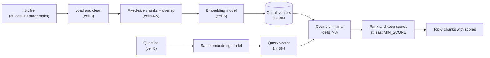

# Technical Documentation

This document describes how the notebook [`notebooks/semantic_search_colab.ipynb`](../notebooks/semantic_search_colab.ipynb) works: what each cell does, the algorithms behind it, and the settings that control it.

## Contents
1. [Architecture](#1-architecture)
2. [Cell-by-cell description](#2-cell-by-cell-description)
3. [Chunking with overlap](#3-chunking-with-overlap)
4. [Embeddings](#4-embeddings)
5. [Cosine similarity and ranking](#5-cosine-similarity-and-ranking)
6. [Settings](#6-settings)
7. [Results on the sample document](#7-results-on-the-sample-document)
8. [Limitations](#8-limitations)

---

## 1. Architecture

The notebook implements **bi-encoder retrieval**, the first stage of a Retrieval-Augmented Generation (RAG) system. Chunks and questions are embedded independently by the same model, and relevance is measured with cosine similarity between their vectors.



Chunks are embedded once. Each question then costs one embedding call and one matrix-vector product.

## 2. Cell-by-cell description

| Cell | Purpose | Main variables it creates |
|---|---|---|
| 1 | Settings: file name, chunk unit, chunk size, overlap percentage, embedding model, number of results | `FILE_PATH`, `CHUNK_UNIT`, `CHUNK_SIZE`, `OVERLAP_PERCENT`, `EMBEDDING_MODEL`, `TOP_K` |
| 2 | Installs `sentence-transformers` | |
| 3 | **Step 1, load.** Uploads the file if it is missing, splits it into paragraphs, prints statistics, checks for at least 10 paragraphs, and joins the paragraphs into one clean text | `raw_text`, `paragraphs`, `text` |
| 4 | **Step 2, chunk.** Validates the 10-20% overlap, computes the overlap and step, cuts the text into windows, and shows a table of chunks | `overlap`, `step`, `chunks`, `chunks_df` |
| 5 | Overlap check: prints the end of chunk 0 and the start of chunk 1 to show the shared text | |
| 6 | **Step 3, embed.** Loads the embedding model and encodes every chunk | `model`, `chunk_vectors` |
| 7 | **Step 6 helper.** Defines `cosine_similarity(query_vector, matrix)` | |
| 8 | **Steps 4-7, search.** Sets `MIN_SCORE`, defines `semantic_search()`, asks for a question, embeds it with the same model, scores every chunk, ranks them and prints the top 3 | `MIN_SCORE`, `question`, `results` |

### Cell 3: loading

```python
paragraphs = [" ".join(p.split()) for p in re.split(r"\n\s*\n", raw_text) if p.strip()]
if len(paragraphs) < 2:
    paragraphs = [" ".join(p.split()) for p in raw_text.splitlines() if p.strip()]
text = " ".join(paragraphs)
```

- Paragraphs are separated by **blank lines**. If the file has none, each non-empty line is a paragraph.
- `" ".join(p.split())` collapses tabs, line breaks and repeated spaces into single spaces.
- The paragraphs are joined into one continuous `text`, which is what gets chunked. Paragraphs are only used to check the 10-paragraph requirement, so chunks can span paragraph boundaries.

### Cell 8: search

```python
query_vector = model.encode(question)                       # Step 5: same embedding model
scores = cosine_similarity(query_vector, chunk_vectors)     # Step 6: cosine similarity
ranking = np.argsort(scores)[::-1][:top_k]                  # Step 7: rank, highest first
confident = [i for i in ranking if scores[i] >= MIN_SCORE]  # keep only confident matches
```

The function prints the question, then each returned chunk with its rank, chunk number and similarity score. If no chunk in the top `TOP_K` reaches `MIN_SCORE`, it prints that the answer is not in the document.

## 3. Chunking with overlap

A window of `CHUNK_SIZE` characters slides over the text. Each new window starts `step` characters after the previous one:

```
overlap = round(CHUNK_SIZE x OVERLAP_PERCENT / 100) = round(800 x 0.15) = 120
step    = CHUNK_SIZE - overlap                       = 800 - 120         = 680
```

```
chunk 0: characters [   0,  800)
chunk 1: characters [ 680, 1480)   shares 680-800 with chunk 0
chunk 2: characters [1360, 2160)   shares 1360-1480 with chunk 1
...
chunk 7: characters [4760, 5114)   the remaining 354 characters
```

`sliding_windows()` stops as soon as a window reaches the end of the text, so the last chunk is never fully contained in the previous one. For a text of length *L*:

```
number of chunks = ceil((L - CHUNK_SIZE) / step) + 1 = ceil((5114 - 800) / 680) + 1 = 8
```

**Why overlap:** a sentence that falls on a boundary would otherwise be split between two chunks and match poorly in both. With 120 shared characters, boundary text appears complete in at least one chunk. The notebook enforces the required range with `assert 10 <= OVERLAP_PERCENT <= 20`.

**Token mode:** with `CHUNK_UNIT = "tokens"`, the window is measured in tokens of the embedding model's tokenizer. The tokenizer's offset mapping converts each token window back to the exact original text. One token is roughly four English characters, and the model reads at most 512 tokens per chunk.

## 4. Embeddings

| Property | `BAAI/bge-small-en-v1.5` |
|---|---|
| Architecture | BERT-style transformer encoder (bi-encoder) |
| Parameters | about 33 million |
| Vector size | 384 |
| Maximum input | 512 tokens |
| Language | English |

An 800-character chunk is about 200 tokens, well within the 512-token limit, so no chunk is truncated. The same model encodes the chunks (cell 6) and the question (cell 8); vectors from different models cannot be compared.

## 5. Cosine similarity and ranking

Cell 7 implements cosine similarity explicitly:

$$
\text{cosine}(A, B) = \frac{A \cdot B}{\lVert A \rVert \, \lVert B \rVert}
$$

```python
dot_products = matrix @ query_vector                                   # A . B for every chunk
norms = np.linalg.norm(matrix, axis=1) * np.linalg.norm(query_vector)  # |A| x |B|
return dot_products / norms
```

Cosine similarity compares the **direction** of two vectors and ignores their length, so a longer chunk is not favoured for containing more words. Scores range from -1 to 1; higher means closer in meaning.

Ranking uses `np.argsort(scores)[::-1]` to order chunks from highest to lowest score, keeps the first `TOP_K`, and then removes any below `MIN_SCORE`.

## 6. Settings

| Setting | Value | Effect of increasing it |
|---|---|---|
| `CHUNK_SIZE` | 800 | Fewer, longer chunks: more context per answer and better coverage of broad questions, but individual facts are mixed with more surrounding text |
| `OVERLAP_PERCENT` | 15 | More text shared between neighbours, so fewer facts are split at boundaries; slightly more chunks. Must stay between 10 and 20 |
| `CHUNK_UNIT` | `"characters"` | `"tokens"` measures chunks the way the model counts its input |
| `TOP_K` | 3 | More chunks returned |
| `MIN_SCORE` | 0.20 | Stricter filtering: chunks below the value are not returned |

After changing a setting in cell 1, re-run cell 1 and every cell after it. `TOP_K` is read when cell 8 defines `semantic_search()`, so cell 8 must also be re-run.

## 7. Results on the sample document

Input: [`data/sample_football_clubs.txt`](../data/sample_football_clubs.txt), 10 paragraphs about football clubs.

| Measure | Value |
|---|---|
| Paragraphs | 10 |
| Characters | 5,114 |
| Words | 900 |
| Overlap / step | 120 / 680 characters |
| Chunks | 8 (seven of 800 characters, one of 354) |
| Vectors | 8 x 384 |

Which clubs each chunk covers:

| Chunk | Clubs mentioned |
|---|---|
| 0 | Al Hilal, Al Nassr |
| 1 | Al Nassr, Al Ittihad |
| 2 | Al Ittihad, Real Madrid, FC Barcelona |
| 3 | FC Barcelona, Manchester United |
| 4 | Manchester United, Liverpool |
| 5 | Liverpool, Bayern Munich, Juventus |
| 6 | Juventus, AC Milan |
| 7 | AC Milan |

Search results:

| Question | Top 3 chunks (score) | Outcome |
|---|---|---|
| how many saudi clubs do we have | 0 (0.7366), 1 (0.7234), 4 (0.6881) | All three Saudi clubs are in chunks 0 and 1 |
| Which club signed Karim Benzema? | 1 (0.6331), 5 (0.6231), 0 (0.6191) | Chunk 1 contains "Al Ittihad signed the French striker Karim Benzema" |
| What is the capital of France? | 3 (0.5300), 2 (0.5193), 5 (0.5057) | Not in the document; three unrelated chunks are returned |

The correct chunks rank first for both questions the document answers, and they score higher (0.63 to 0.74) than anything returned for the unrelated question (0.51 to 0.53). With `MIN_SCORE = 0.20`, the unrelated question still returns results; a threshold of about 0.6 would separate the two groups in this example.

## 8. Limitations

- **Retrieval only:** the notebook returns passages, not a generated answer.
- **Top-k is not exhaustive:** answers spread over more than `TOP_K` chunks can be partly missed.
- **Threshold:** at 0.20, `MIN_SCORE` does not filter out questions the document does not answer.
- **Character windows cut words** at chunk boundaries; the overlap compensates at the edges.
- **English-only model:** use a multilingual model such as `BAAI/bge-m3` for Arabic text.
- **Colab-specific upload:** cell 3 imports `google.colab`; outside Colab, remove the import and point `FILE_PATH` to a local file.
