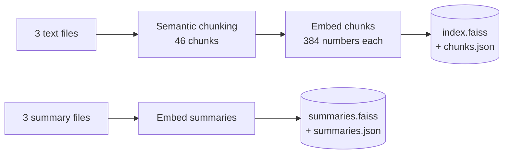
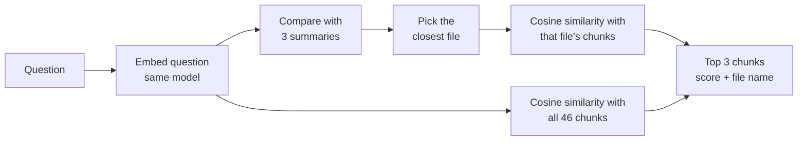
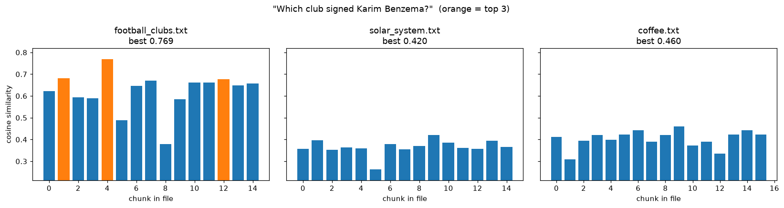

# Assignment 2: Semantic Chunking and a FAISS Vector Database


A retrieval pipeline over three documents from different fields. The documents are split into chunks by meaning, embedded with a sentence-embedding model, and stored in a FAISS vector database saved to Google Drive. Each document also has a short summary stored in its own FAISS index. A question is answered by ranking chunks with cosine similarity and returning the top 3 with the file they came from.

Part of the **Generative AI Solutions Development** program at [SDAIA Academy](https://github.com/SDAIAAcademy). See the [repository overview](../README.md) for the full list of projects.

## Contents

- [How it works](#how-it-works)
- [Getting started](#getting-started)
- [Configuration](#configuration)
- [Results](#results)
- [Verification](#verification)
- [What changed from Assignment 1](#what-changed-from-assignment-1)
- [Folder structure](#folder-structure)
- [Limitations](#limitations)
- [Arabic summary](#arabic-summary)

## How it works

The notebook has two phases.

**Ingestion (offline, runs once)**



**Retrieval (runtime, every question)**



| Step | What happens |
|---|---|
| 1. Load | Read `football_clubs.txt`, `solar_system.txt` and `coffee.txt` and split each into paragraphs |
| 2. Semantic chunking | Split every paragraph into sentences, embed them, and cut where consecutive sentences are least related (the lowest 10% of similarities in that file). Paragraphs are always separate chunks, and no chunk exceeds 1,000 characters |
| 3. Embed and store | Embed every chunk, normalise the vectors to length 1, and store them in a FAISS `IndexFlatIP`. Save the index, the chunk texts with their file names, and the settings to Google Drive. The three summaries are embedded and saved as a second index |
| 4-5. Question | The question is embedded with the same model |
| 6. Similarity | FAISS computes the inner product with every stored vector. Because all vectors have length 1, this equals cosine similarity |
| 7. Results | The top 3 chunks are printed with their score and source file, as Question and Answers |

Two search modes are provided:
- **Plain search** compares the question with all 46 chunks from the three files.
- **Summary-first search** compares the question with the three summaries, picks the closest file, then searches only that file's chunks.

On later runs, the notebook finds the saved database on Google Drive and skips the ingestion phase entirely.

The full cell-by-cell description is in the [technical documentation](docs/TECHNICAL_DOCUMENTATION.md).

## Getting started

1. Open [Google Colab](https://colab.research.google.com/) and upload [`notebooks/semantic_chunking_faiss_colab.ipynb`](notebooks/semantic_chunking_faiss_colab.ipynb).
2. Upload the three documents from [`data/`](data/) and the three summaries from [`data/summaries/`](data/summaries/) to the Colab Files panel.
3. Run all cells and allow access to Google Drive when asked. Type a question at each prompt.

The vector database is saved to `MyDrive/assignment2_vector_db/`. From the second run onward, no files need to be uploaded.

## Configuration

All settings are in the first cell.

| Setting | Value | Description |
|---|---|---|
| `FILES` | 3 files | The documents to index |
| `EMBEDDING_MODEL` | `BAAI/bge-small-en-v1.5` | Used for sentences, chunks, summaries and questions |
| `SEMANTIC_PERCENTILE` | `10` | Inside a paragraph, cut where sentence-to-sentence similarity is in the lowest 10% for that file |
| `MAX_CHUNK_CHARS` | `1000` | Maximum chunk length |
| `TOP_K` | `3` | Number of results returned |
| `USE_GOOGLE_DRIVE` | `True` | Save the database to Google Drive so it survives Colab restarts |
| `REBUILD` | `False` | Set to `True` to rebuild the database from the text files |

If any setting that affects the stored vectors changes (files, model, percentile, chunk size limit), the saved database no longer matches and is rebuilt automatically.

## Results

Results from running the notebook on the three documents in [`data/`](data/).

**Ingestion**

| File | Paragraphs | Chunks | Cut threshold | Average chunk | Smallest | Largest |
|---|---|---|---|---|---|---|
| football_clubs.txt | 10 | 15 | 0.499 | 340 chars | 75 | 527 |
| solar_system.txt | 12 | 15 | 0.542 | 321 chars | 47 | 464 |
| coffee.txt | 12 | 16 | 0.513 | 307 chars | 99 | 513 |

46 chunks are stored as 46 vectors of 384 numbers (`index.faiss`, 69 KB), and 3 summaries as a second index (`summaries.faiss`).

**Plain search (all 46 chunks)**

| Question | #1 answer | Score | #2 | #3 |
|---|---|---|---|---|
| Which club signed Karim Benzema? | football_clubs.txt, chunk 4: "In 2023 Al Ittihad signed the French striker Karim Benzema" | 0.7685 | football, 0.6805 | football, 0.6771 |
| Where is Khawlani coffee grown? | coffee.txt, chunk 45: "In the mountains of the Jazan region..." | 0.7797 | coffee, 0.6486 | coffee, 0.6408 |
| Which planet is the hottest? | solar_system.txt, chunk 19: "Venus is the hottest planet..." | 0.8703 | solar system, 0.7401 | solar system, 0.6883 |
| What is the capital of France? | football_clubs.txt, chunk 7 (not relevant) | 0.5719 | football, 0.5513 | football, 0.5422 |

**Summary-first search**

| Question | Summary scores | File selected | Top 3 chunks |
|---|---|---|---|
| How many Saudi clubs are mentioned? | football 0.7638, coffee 0.5752, solar 0.4811 | football_clubs.txt | Al Hilal (0.7402), Al Ittihad (0.6789), Al Nassr (0.6779) |
| Which planet is the hottest? | solar 0.6773, coffee 0.4782, football 0.4356 | solar_system.txt | chunks 19, 17, 27 |
| Where is Khawlani coffee grown? | coffee 0.6616, football 0.4029, solar 0.3469 | coffee.txt | chunks 45, 30, 38 |

For each question answered by the documents, the correct file and the correct chunk rank first. Relevant answers score 0.74 to 0.87, while the unrelated question about France scores at most 0.57.



*Similarity of the question "Which club signed Karim Benzema?" with every chunk, grouped by file. Only the football file has high scores; the top 3 are in orange.*

## Verification

The notebook ends with check cells that test every step and print a check mark for each test.

| Step | Checks | Result |
|---|---|---|
| Step 1: load files | 3 files configured, each has at least 10 paragraphs, the files are different, every file is in the database | 6/6 |
| Step 2: semantic chunking | No empty chunks, none over 1,000 characters, every chunk ends at a sentence, the chunks rebuild every paragraph exactly, no overlap (136 sentences in the files, 136 in the chunks), every cut inside a paragraph is below the file's threshold (12 meaning cuts, 31 paragraph cuts) | 6/6 |
| Step 3: embeddings and FAISS | One vector per chunk, 384 numbers each, every vector has length 1, inner-product index, stored vector equals a fresh embedding, 3 summaries stored, database saved to disk | 7/7 |
| Tokens | Every chunk fits the 512-token limit (largest is 116 tokens) | 1/1 |
| Steps 4-7: search | Same model and vector size, top 3 returned, ranked by score, FAISS scores equal the cosine formula (difference 6e-08), FAISS compared every chunk, every answer has its file name, summary routing picks a valid file | 7/7 |

**27 of 27 checks passed.** When the text files are not uploaded and the saved database is used, the 6 checks that need the original text are skipped and the other 21 pass.

Token usage with `bge-small-en-v1.5`: 3,175 tokens for the 46 chunks, 3,355 for the sentence embeddings used to decide the cuts, 341 for the summaries, and 9 for a typical question.

## What changed from Assignment 1

| | [Assignment 1](../assignment-1-semantic-search/) | Assignment 2 |
|---|---|---|
| Documents | 1 file | 3 files from different fields |
| Chunking | Fixed size: 800 characters, 15% overlap | Semantic: paragraphs and meaning shifts, whole sentences only |
| Chunk sizes | Equal (800, except the last) | Variable (47 to 527 characters) |
| Overlap | 120 characters between neighbours | None needed: cuts fall between whole sentences |
| Vector storage | NumPy array in memory | FAISS index saved to Google Drive |
| Re-running | Re-chunks and re-embeds every time | Loads the saved database and skips ingestion |
| Search | One file | All three files, or summary-first routing to one file |
| Results show | Chunk number and score | File name, chunk number and score |

## Folder structure

```
assignment-2-semantic-faiss/
├── notebooks/
│   ├── semantic_chunking_faiss_colab.ipynb   # The pipeline (Assignment 2 submission)
│   └── semantic_chunking_faiss_colab.py      # The same code as a Python file
├── data/
│   ├── football_clubs.txt                    # 10 paragraphs
│   ├── solar_system.txt                      # 12 paragraphs
│   ├── coffee.txt                            # 12 paragraphs
│   └── summaries/                            # One summary per document
├── docs/
│   ├── TECHNICAL_DOCUMENTATION.md            # Cell-by-cell description, algorithms, results
│   └── images/
├── requirements.txt
└── README.md
```

## Limitations

- **Retrieval only.** The notebook returns passages, not a generated answer. Passing the top chunks to an LLM is the generation stage of RAG.
- **No relevance threshold.** The top 3 are always returned, as the assignment requires, so unrelated questions still get answers (see the France example).
- **Summary routing picks one file.** A question that needs facts from two documents is answered from the closest file only.
- **Small chunks can lose their subject.** A chunk such as "It was founded in 1899 by a group led by the Swiss businessman Joan Gamper" does not name the club it belongs to.
- **English model.** Arabic documents need a multilingual model such as `BAAI/bge-m3`.

## Arabic summary

المشروع الثاني ضمن دورة **تطوير حلول الذكاء الاصطناعي التوليدي** في أكاديمية سدايا.

يقرأ الدفتر ثلاثة ملفات نصية من مجالات مختلفة (كرة القدم، والمجموعة الشمسية، والقهوة)، ثم يقسمها إلى أجزاء حسب المعنى (Semantic Chunking): تبقى الفقرات منفصلة، وتُقسم الفقرة عند تغيّر الموضوع بين الجمل. تُحوَّل الأجزاء إلى متجهات باستخدام نموذج التضمين `bge-small-en-v1.5` وتُحفظ في قاعدة بيانات متجهات FAISS على Google Drive، مع ملخص لكل ملف في فهرس مستقل. عند طرح سؤال، يُحوَّل إلى متجه بالنموذج نفسه، ويُحسب تشابه جيب التمام مع الأجزاء، وتُعرض أفضل ثلاثة أجزاء مع درجاتها واسم الملف. ويمكن أيضاً قراءة الملخصات أولاً لاختيار الملف الأقرب ثم البحث داخله فقط.
