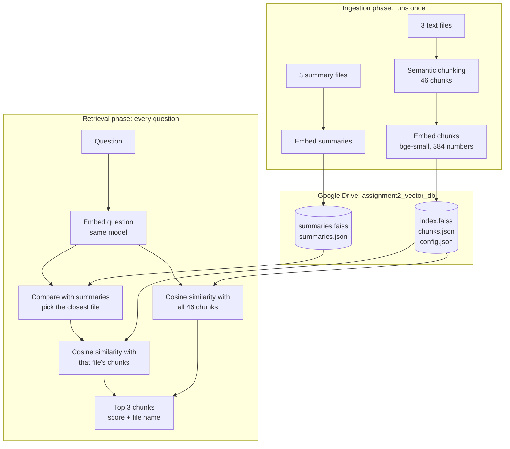

# Technical Documentation: Assignment 2

Part of the **Generative AI Solutions Development** program at [SDAIA Academy](https://github.com/SDAIAAcademy).

This document describes how [`notebooks/semantic_chunking_faiss_colab.ipynb`](../notebooks/semantic_chunking_faiss_colab.ipynb) works: what each cell does, the algorithms behind it, how the vector database is stored and reused, and the results it produces.

## Contents
1. [Architecture](#1-architecture)
2. [Cell-by-cell description](#2-cell-by-cell-description)
3. [Semantic chunking](#3-semantic-chunking)
4. [The FAISS vector database](#4-the-faiss-vector-database)
5. [Saving and reusing the database](#5-saving-and-reusing-the-database)
6. [Search](#6-search)
7. [Verification and token usage](#7-verification-and-token-usage)
8. [Limitations](#8-limitations)

---

## 1. Architecture



The ingestion phase is skipped when a database with the same settings already exists on Google Drive. The retrieval phase always loads the database from disk.

## 2. Cell-by-cell description

| Cell | Purpose |
|---|---|
| 1 | **Settings:** files, embedding model, chunking settings (`SEMANTIC_PERCENTILE`, `MAX_CHUNK_CHARS`), `TOP_K`, storage location and `REBUILD` |
| 2 | Installs `sentence-transformers` and `faiss-cpu` |
| 3 | **Setup:** imports, mounts Google Drive, loads the embedding model, defines the database file paths, and sets `NEED_INGESTION` by comparing the saved `config.json` with the current settings |
| 4 | **Step 1, load** (ingestion): uploads missing files, splits each file into paragraphs, and shows paragraph, character and word counts |
| 5 | **Step 2, semantic chunking** (ingestion): splits paragraphs into sentences, embeds them, cuts where the meaning changes, and labels every chunk with its id, file and paragraph |
| 6 | **Summaries:** reads the three summary files, embeds them, stores them in a separate FAISS index on Drive (or loads it if it already exists), and shows which document each summary describes |
| 7 | **Step 3, embed and store** (ingestion): embeds the chunks, normalises them, builds the FAISS index and saves `index.faiss`, `chunks.json` and `config.json` |
| 8 | **Load the database** (retrieval): reads the index and chunk list from Drive and extracts the stored vectors |
| 9 | Defines `cosine_similarity()`: `(A · B) / (‖A‖ × ‖B‖)` |
| 10 | **Summary-first search:** compares the question with the summaries, selects the closest file, and returns the top 3 chunks of that file |
| 11 | **Steps 4-7, plain search:** embeds the question, searches every stored chunk with FAISS, and prints the top 3 with file names |
| 12 | Compares the FAISS scores with the cosine formula for the top 3 |
| 13 | Plots the similarity of every chunk to the question, one panel per file |
| 14 | Asks more questions in a loop |
| 15 | **Checks:** sets up the checklist and the test question |
| 16 | Checks for Step 1 |
| 17 | Checks for Step 2, plus a table of every chunk boundary and why it was cut |
| 18 | Checks for Step 3 and lists the saved database files |
| 19 | Token usage per file, per stage, and with three different tokenizers |
| 20 | Checks for Steps 4-7 and the summary routing |

## 3. Semantic chunking

`semantic_chunks()` in cell 5 decides where to cut using the meaning of the text.

**Algorithm**

1. Split every paragraph into sentences at `.`, `!` or `?` followed by a space.
2. Embed every sentence (normalised, so a dot product is a cosine similarity).
3. Compute the similarity of each sentence with the next one.
4. Set the file's threshold to the 10th percentile of those similarities (`SEMANTIC_PERCENTILE = 10`).
5. Walk through the sentences and start a new chunk when the next sentence:
   - belongs to a different paragraph, or
   - has a similarity below the threshold (the topic changes), or
   - would make the chunk longer than `MAX_CHUNK_CHARS`.

Each file gets its own threshold because writing styles differ: 0.499 for football, 0.542 for the Solar System and 0.513 for coffee.

**Example: the first football paragraph**

| Sentence | Text | Similarity with the next |
|---|---|---|
| s0 | Al Hilal is a professional football club based in the capital Riyadh, Saudi Arabia. | 0.542 |
| s1 | It was founded in 1957 and plays its matches in blue and white kits. | **0.467** |
| s2 | Fans call the club Al Za'eem, which means The Leader, because it has won more trophies than any other Saudi team. | 0.688 |
| s3 | Al Hilal is also one of the most successful clubs in Asian football history. | 0.635 |
| s4 | In 2023 the club signed the Brazilian star Neymar... | |

Only s1 to s2 (0.467) is below the football threshold of 0.499, so the paragraph becomes two chunks:
- **Chunk 0:** s0 and s1 (location, founding year, colours)
- **Chunk 1:** s2, s3 and s4 (nickname, reputation, Neymar)

**Result**

| File | Paragraphs | Chunks | Threshold | Cuts inside paragraphs |
|---|---|---|---|---|
| football_clubs.txt | 10 | 15 | 0.4991 | 5 |
| solar_system.txt | 12 | 15 | 0.5421 | 3 |
| coffee.txt | 12 | 16 | 0.5133 | 4 |

All 12 cuts made inside paragraphs, with the text on each side:

| File | Between chunks | Similarity | End of first chunk | Start of next chunk |
|---|---|---|---|---|
| football | 0 \| 1 | 0.4668 | ...plays its matches in blue and white kits. | Fans call the club Al Za'eem... |
| football | 3 \| 4 | 0.4890 | ...fans call it Al Ameed, meaning The Dean. | The team wears the famous yellow and black stripes... |
| football | 4 \| 5 | 0.4906 | ...Karim Benzema, a former Ballon d'Or winner. | The club plays home games at King Abdullah Sports City... |
| football | 7 \| 8 | 0.4694 | ...in the Catalonia region of Spain. | It was founded in 1899 by a group led by... |
| football | 8 \| 9 | 0.4708 | ...the Swiss businessman Joan Gamper. | The club motto is Mes que un club... |
| solar system | 17 \| 18 | 0.5327 | ...minus 180 degrees Celsius at night. | Mercury completes one orbit around the Sun... |
| solar system | 19 \| 20 | 0.4721 | ...hot enough to melt lead. | Venus also spins backwards... |
| solar system | 21 \| 22 | 0.5313 | ...the only planet known to support life. | About 71 percent of its surface is covered by water... |
| coffee | 30 \| 31 | 0.4947 | ...grows naturally in the highlands of Ethiopia. | A popular legend tells of a goat herder named Kaldi... |
| coffee | 31 \| 32 | 0.4821 | ...the red berries of a certain bush. | Whether or not the story is true... |
| coffee | 33 \| 34 | 0.4688 | ...during long nights of prayer. | Coffee was shipped from the Yemeni port of Mocha... |
| coffee | 36 \| 37 | 0.5132 | ...smooth, sweet and aromatic flavour. | It grows best at high altitudes... |

**Why there is no overlap:** in Assignment 1, fixed windows cut through the middle of sentences, so neighbouring chunks share 15% of their text to keep boundary sentences intact. Here every cut falls between two complete sentences, so nothing is split. The checks confirm that the 136 sentences in the files appear exactly once across the 46 chunks.

## 4. The FAISS vector database

Cell 7 builds the database:

```python
chunk_vectors = model.encode([c["text"] for c in chunk_records]).astype("float32")
faiss.normalize_L2(chunk_vectors)                   # every vector gets length 1
index = faiss.IndexFlatIP(chunk_vectors.shape[1])   # 384 dimensions, inner product
index.add(chunk_vectors)
```

- **`IndexFlatIP`** stores the vectors as a flat table and compares a query with every one of them (exact search).
- **Inner product equals cosine similarity** after normalisation: cosine(A, B) = (A · B) / (‖A‖ × ‖B‖), and with ‖A‖ = ‖B‖ = 1 this is A · B.
- FAISS stores only numbers. `chunks.json` maps each vector position to its text, file and paragraph, so a result can be shown as text.

| File | Content | Size |
|---|---|---|
| `index.faiss` | 46 vectors x 384 numbers (float32) | 69.0 KB |
| `chunks.json` | Chunk id, file, paragraph and text for each vector | 18.3 KB |
| `config.json` | The settings the database was built with | 0.3 KB |
| `summaries.faiss` | 3 summary vectors | 4.5 KB |
| `summaries.json` | The summary texts and the document each one describes | 2.1 KB |

## 5. Saving and reusing the database

The database is saved to `MyDrive/assignment2_vector_db/` because files in Colab's own storage are deleted when the session ends.

Cell 3 decides whether to rebuild:

```python
SETTINGS = {"files": FILES, "embedding_model": EMBEDDING_MODEL,
            "semantic_percentile": SEMANTIC_PERCENTILE, "max_chunk_chars": MAX_CHUNK_CHARS}
NEED_INGESTION = REBUILD or not saved_db_matches()
```

`saved_db_matches()` returns `True` only if all three files exist and the saved settings equal the current ones. When it does, cells 4, 5 and 7 print "Skipped: using the saved vector database", and cell 8 loads the index from disk. The summary index follows the same rule with its own settings.

In a run where none of the text or summary files were uploaded, the notebook loaded the saved database, made no upload request, and produced the same search results.

## 6. Search

**Plain search** (cell 11):

```python
query_vector = model.encode([question]).astype("float32")   # same model
faiss.normalize_L2(query_vector)
scores, ids = index.search(query_vector, top_k)              # cosine with all 46 chunks
```

**Summary-first search** (cell 10):
1. Compare the question with the 3 summary vectors and rank the files.
2. Score the question against all chunks, keep only those from the top-ranked file, and return the best 3.

**Results**

| Question | Mode | Selected file / summary score | Top 3 (chunk: score) |
|---|---|---|---|
| Which club signed Karim Benzema? | Plain | | 4: 0.7685, 1: 0.6805, 12: 0.6771 (all football) |
| Where is Khawlani coffee grown? | Plain | | 45: 0.7797, 30: 0.6486, 38: 0.6408 (all coffee) |
| Which planet is the hottest? | Plain | | 19: 0.8703, 17: 0.7401, 27: 0.6883 (all Solar System) |
| What is the capital of France? | Plain | | 7: 0.5719, 6: 0.5513, 13: 0.5422 (football, not relevant) |
| How many Saudi clubs are mentioned? | Summary-first | football_clubs.txt / 0.7638 | 1: 0.7402 (Al Hilal), 3: 0.6789 (Al Ittihad), 2: 0.6779 (Al Nassr) |
| Which planet is the hottest? | Summary-first | solar_system.txt / 0.6773 | 19: 0.8703, 17: 0.7401, 27: 0.6883 |
| Where is Khawlani coffee grown? | Summary-first | coffee.txt / 0.6616 | 45: 0.7797, 30: 0.6486, 38: 0.6408 |
| What is the capital of France? | Summary-first | football_clubs.txt / 0.4635 | 7: 0.5719, 6: 0.5513, 13: 0.5422 |

For the three questions the documents answer, both modes return the same chunks, because the best chunk overall is already in the file the summaries select. Summary-first search also answers "How many Saudi clubs are mentioned?" with one chunk for each Saudi club. The unrelated question still returns three chunks, since the notebook has no minimum score; its summary score (0.4635) and chunk scores (at most 0.5719) are clearly lower than those of real questions.

Cell 12 confirms that FAISS and the cosine formula give the same scores:

| Rank | Chunk | FAISS score | Cosine formula |
|---|---|---|---|
| 1 | 4 | 0.7685 | 0.7685 |
| 2 | 1 | 0.6805 | 0.6805 |
| 3 | 12 | 0.6771 | 0.6771 |

## 7. Verification and token usage

Cells 15 to 20 test each step and record a pass or fail for every check. On a full run, **27 of 27 checks pass** (6 for loading, 6 for chunking, 7 for the database, 1 for tokens, 7 for search). See the [README](../README.md#verification) for the list.

**Tokens with `bge-small-en-v1.5`** (limit 512 per text):

| File | Chunks | Total tokens | Average | Largest | Tokens per word |
|---|---|---|---|---|---|
| coffee.txt | 16 | 1,055 | 65.9 | 109 | 1.3 |
| football_clubs.txt | 15 | 1,099 | 73.3 | 116 | 1.2 |
| solar_system.txt | 15 | 1,021 | 68.1 | 99 | 1.2 |

| Stage | Tokens embedded |
|---|---|
| Sentences (to decide where to cut) | 3,355 |
| Chunks (stored in FAISS) | 3,175 |
| Summaries | 341 |
| One question ("Which club signed Karim Benzema?") | 9 |

The same chunks counted with other tokenizers:

| Tokenizer | Vocabulary | Total tokens | Tokens per word |
|---|---|---|---|
| BAAI/bge-small-en-v1.5 | 30,522 | 3,175 | 1.24 |
| sentence-transformers/all-MiniLM-L6-v2 | 30,522 | 3,175 | 1.24 |
| BAAI/bge-m3 | 250,002 | 3,560 | 1.39 |

`bge-small` and `all-MiniLM` share the same vocabulary, so their counts are identical. The multilingual `bge-m3` uses a much larger vocabulary designed for many languages and splits English slightly more.

## 8. Limitations

- **Retrieval only:** no LLM generates a written answer from the retrieved chunks.
- **No minimum score:** the top 3 are always returned, including for unrelated questions.
- **One file per answer** in summary-first search.
- **Chunks can lose context:** a chunk such as "It was founded in 1899 by a group led by the Swiss businessman Joan Gamper" does not name its club.
- **Flat index:** exact search compares every vector, which is ideal for 46 chunks but slow for millions. Large collections would use an approximate index such as HNSW or IVF.
- **English-only model.**
