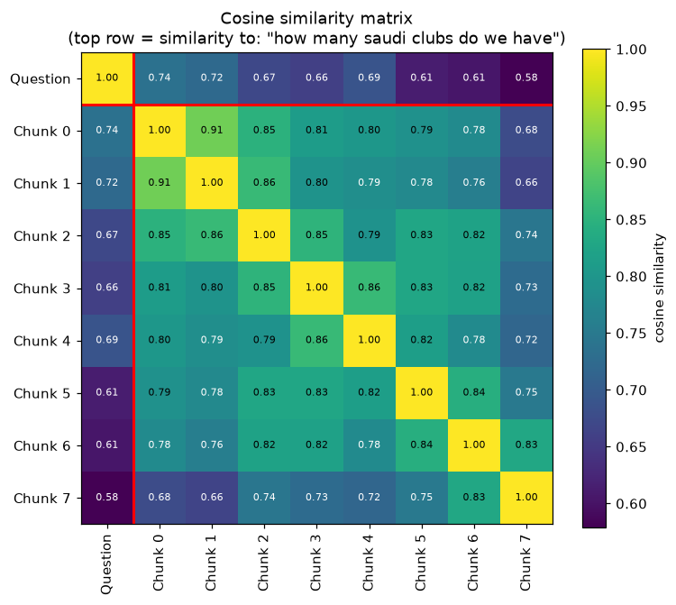

# Experiments

How the chunking parameters and the confidence threshold affect retrieval. All results use the sample file [`data/sample_football_clubs.txt`](../data/sample_football_clubs.txt) (10 paragraphs, 5,114 characters) and the model `BAAI/bge-small-en-v1.5`.

Reproduce everything with:

```bash
python scripts/run_experiments.py
```

---

## 1. Chunk size

**Question:** *"how many saudi clubs do we have"*. The text describes three Saudi clubs (Al Hilal, Al Nassr, Al Ittihad), each in its own paragraph. This is a **broad** question: a complete answer needs chunks from three different paragraphs.

Overlap 15%, `TOP_K = 3`:

| Chunk size (chars) | Chunks | Saudi clubs found (`MIN_SCORE = 0.6`) | Saudi clubs found (`MIN_SCORE = 0.7`) |
|---|---|---|---|
| 200 | 30 | 2/3 (Ittihad missing) | 2/3 |
| 300 | 20 | **3/3** | **3/3** |
| 500 | 12 | 2/3 (Ittihad missing) | 2/3 |
| **800** | **8** | **3/3** | **3/3** |
| 1000 | 6 | **3/3** | **3/3** |

**Observations**
- With **small chunks**, each club's paragraph is split into several pieces. The three result slots can fill up with two pieces of the same club, leaving no room for the third.
- With **500 characters**, the Al Ittihad chunks ranked 4th and 5th (scores 0.671 and 0.664), just outside the top 3.
- With **800 characters or more**, the three Saudi paragraphs fit into two chunks, both scoring above 0.72, so all three clubs are returned even with `TOP_K = 3`.
- Chunk size and `TOP_K` work together: small chunks need a larger `TOP_K` to cover broad answers.

**Chosen default: 800 characters.** It keeps every chunk far below the model's 512-token limit (about 200 tokens) and answers broad questions completely.

## 2. Overlap

| Overlap (size 500) | Overlap length | Step | Chunks |
|---|---|---|---|
| 10% | 50 | 450 | 12 |
| 15% | 75 | 425 | 12 |
| 20% | 100 | 400 | 13 |

Within the required 10–20% range, overlap changes the number of chunks only slightly. Its purpose is robustness: text at a chunk boundary appears complete in at least one chunk. **Chosen default: 15%**, the middle of the allowed range.

## 3. Confidence threshold calibration

Nearest-neighbour search always returns *something*, so a minimum similarity (`MIN_SCORE`) is needed to say "this is not in the document". To choose it, 8 questions answered in the text and 8 unrelated questions were asked, and the **best chunk score** of each was recorded.


| Chunk size | In-text questions: lowest / average | Not-in-text questions: highest / average | Correct at `MIN_SCORE = 0.6` |
|---|---|---|---|
| 200 | 0.638 / 0.789 | 0.616 / 0.486 | 94% |
| 300 | 0.527 / 0.744 | 0.609 / 0.469 | 88% |
| 500 | 0.555 / 0.724 | 0.575 / 0.452 | 94% |
| 800 | 0.568 / 0.673 | 0.634 / 0.448 | 88% |
| 1000 | 0.555 / 0.686 | 0.600 / 0.442 | 88% |

**Observations**
- Most unrelated questions (capital of France, baking bread, iPhone prices) score **0.36–0.53**, well below real answers.
- The hard cases are on the **same topic**: *"Who won the 2022 World Cup?"* is about football but not answered by the text, and scores up to 0.634.
- **Smaller chunks give higher scores** to real answers (average 0.789 at 200 characters against 0.673 at 800), because a short chunk is about one thing and matches a specific question strongly.
- **Larger chunks dilute specific facts.** *"Which fans sing You'll Never Walk Alone?"* scores 0.568 at 800 characters, because the anthem is a small part of a chunk that also covers Liverpool's history, Istanbul 2005 and Bayern Munich.

**Chosen default: `MIN_SCORE = 0.6`**, which rejects all clearly off-topic questions. There is a trade-off with chunk size: 800 characters is best for broad questions, while 200–500 characters separate real from unrelated questions more cleanly.

## 4. Visualising one search

For *"how many saudi clubs do we have"* (800-character chunks), each bar is one chunk's similarity and the orange bars are the top 3. Chunks 0 and 1 contain the three Saudi clubs and clearly stand out from the average (dashed line). Chunk 4 (Manchester United) is third, with a lower score of 0.688:


The similarity matrix for the same question shows the question (top row) against every chunk, and every chunk against every other chunk. Neighbouring chunks are often similar because they share overlap text and topic:



## Summary

| Goal | Recommended setting |
|---|---|
| Broad questions ("how many…", "list all…") | Larger chunks (800–1000) or a larger `TOP_K` |
| Specific fact lookup | Smaller chunks (200–500) |
| Reject questions the document can't answer | `MIN_SCORE` ≈ 0.6 for `bge-small-en-v1.5`, re-calibrated for other models |
| Robust boundaries | 15% overlap |
