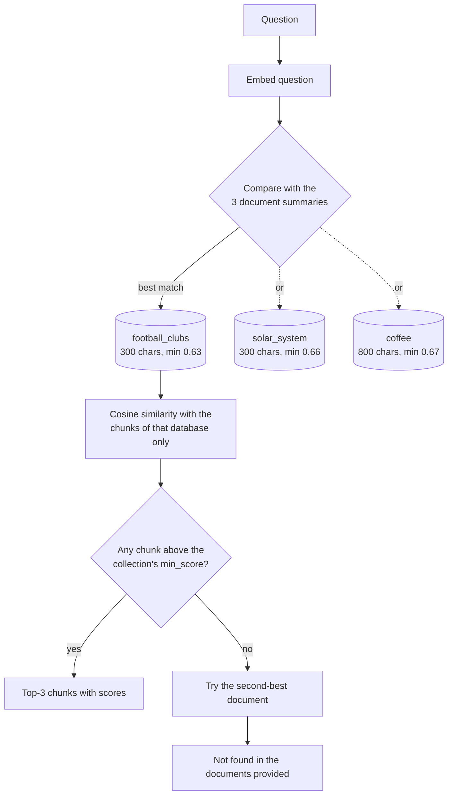

# Multi-Document Routing

This extension searches several documents on different subjects. Each document has its own vector database with settings tuned for its content, and a short summary. Questions are routed to the right document by comparing them with the summaries **before** any chunk-level similarity search.

## Contents
1. [Architecture](#1-architecture)
2. [Documents and summaries](#2-documents-and-summaries)
3. [Per-collection tuning](#3-per-collection-tuning)
4. [Routing](#4-routing)
5. [Vector database format](#5-vector-database-format)
6. [Usage](#6-usage)
7. [Results](#7-results)
8. [Limitations](#8-limitations)

---

## 1. Architecture



**Two-stage search**

| Stage | Compares the question with | Decides |
|---|---|---|
| 1. Routing | 3 summaries (one vector each) | **Which** document to search |
| 2. Retrieval | The chunks of the selected document | **Whether** the answer exists, and which chunks contain it |

Routing first means each question is compared with 3 summaries plus one document's chunks (for example 3 + 19 comparisons) instead of every chunk of every document (44). It also stops chunks from an unrelated document from appearing in the results.

## 2. Documents and summaries

| Collection | Document | Paragraphs | Characters | Subject |
|---|---|---|---|---|
| `football_clubs` | [`data/sample_football_clubs.txt`](../data/sample_football_clubs.txt) | 10 | 5,114 | Ten football clubs: history, stadiums, players |
| `solar_system` | [`data/solar_system.txt`](../data/solar_system.txt) | 12 | 4,829 | The Sun, the planets, dwarf planets, space missions |
| `coffee` | [`data/coffee.txt`](../data/coffee.txt) | 12 | 4,924 | Coffee history, species, farming, roasting, brewing, Arabic coffee |

Each document has a summary in [`data/summaries/`](../data/summaries/). A good routing summary:
- names the **subject** in its first words ("A guide to coffee", "An introduction to astronomy"),
- lists the **entities and topics** a user might ask about (club names, planet names, brewing methods),
- stays short (about 80 words), so it represents the whole document rather than one part of it.

The summaries are clearly distinct from one another, which is what makes routing reliable:

| | football_clubs | solar_system | coffee |
|---|---|---|---|
| **football_clubs** | 1.000 | 0.516 | 0.578 |
| **solar_system** | 0.516 | 1.000 | 0.472 |
| **coffee** | 0.578 | 0.472 | 1.000 |

## 3. Per-collection tuning

Each collection is tuned separately with [`scripts/tune_collections.py`](../scripts/tune_collections.py), using the questions in [`data/eval_questions.json`](../data/eval_questions.json):

- **8 answerable questions** per document, each with a keyword the top chunk must contain (hit@1)
- **1 broad question** per document whose keywords must all appear in the top 3 (coverage)
- **2 near-topic questions** per document that sound related but aren't answered (e.g. "What is a black hole?")
- **6 unrelated questions** shared by all documents (e.g. "What is the capital of France?")

**Selection:** every combination of chunk size (300, 500, 800) and overlap (10, 15, 20%) is tried. The winner has the highest hit@1, then coverage, then hit@3, then average best score.

**Threshold:** `min_score` is placed in the middle of the gap between the lowest score of an answerable question and the highest score of a question that should be rejected.

### Results

| Collection | Chunk size | Overlap | Chunks | hit@1 | hit@3 | Lowest answerable score | Highest rejected score | `min_score` |
|---|---|---|---|---|---|---|---|---|
| `football_clubs` | 300 | 10% | 19 | 100% | 100% | 0.671 | 0.589 | **0.63** |
| `solar_system` | 300 | 10% | 18 | 100% | 100% | 0.722 | 0.606 | **0.66** |
| `coffee` | 800 | 10% | 7 | 100% | 100% | 0.698 | 0.634 | **0.67** |

With these thresholds, every answerable, near-topic and unrelated question is accepted or rejected correctly for each collection.

### Why the settings differ

- **Football clubs and Solar System use small chunks (300).** Their answers are single facts ("founded in 1957", "about 465 degrees Celsius"). A small chunk holds one or two facts, so it matches a specific question strongly (average best score 0.76–0.78).
- **Coffee uses large chunks (800).** Its answers are explanations that run over several sentences (how espresso is made, why Robusta is more bitter). At 300 characters the explanation was split and the top chunk held the answer only 62% of the time; at 800 it was 100%.

### Trade-off found

The broad coffee question ("What are the main coffee species and where are they grown?") needs facts from two different paragraphs (Arabica in one, Brazil in another). Only 500-character chunks returned both in the top 3, but at that size hit@1 dropped to 88%. The selection prioritises answering single questions correctly, so coffee keeps 800 characters. For list-style questions on coffee, raise `TOP_K`.

## 4. Routing

### How it works
1. The question is embedded with the same model as the summaries and chunks.
2. Cosine similarity is computed against each summary, and the collections are ranked.
3. The best collection is searched. If none of its chunks reach its `min_score`, the second-best collection is tried (`max_routes = 2`).
4. If no collection produces a confident chunk, the answer is "not in the documents provided".

### Calibration finding: summaries choose, chunks decide

| Measure | Result |
|---|---|
| Answerable questions routed to the correct document | **24 / 24 (100%)** |
| Lowest summary score of an answerable question | 0.405 ("Which fans sing You'll Never Walk Alone?") |
| Highest summary score of an unrelated question | 0.464 ("What is the capital of France?") |

Summaries are excellent at **choosing between** documents: every answerable question scored highest against its own document's summary. They are **not** reliable at deciding whether the answer exists, because a summary covers a whole document. A narrow question like the Liverpool anthem matches a summary weakly, sometimes less than an unrelated question does.

So the responsibilities are split:
- `route_min_score = 0.40` sits just below the lowest answerable score. It only blocks questions that relate to no summary at all, and never blocks a real question.
- Each collection's `min_score` makes the real decision at chunk level, where the evidence is specific.

### Example


*"How many Saudi clubs are mentioned?"* scores 0.764 against the football summary, against 0.575 for coffee and 0.481 for the Solar System. Inside `football_clubs`, the three returned chunks cover Al Hilal, Al Nassr and Al Ittihad.

*"What is a black hole?"* is routed to `solar_system` (0.558), but its best chunk scores only 0.552, below 0.66. The fallback tries `coffee` (0.425 < 0.67), so the result is "not found". The topic is astronomy, but the document doesn't answer it.

## 5. Vector database format

Each collection is saved to `vector_db/<collection>/`:

| File | Content |
|---|---|
| `vectors.npy` | NumPy array of chunk vectors, shape `(chunks, 384)` |
| `chunks.json` | Chunk texts, in the same order as the vectors |
| `config.json` | Collection settings (document, chunk size, overlap, `min_score`) and the summary text |

`VectorStore.load()` restores a database without re-embedding. The folder is generated at runtime and excluded from git.

## 6. Usage

**Notebook:** upload [`notebooks/multi_document_routing_colab.ipynb`](../notebooks/multi_document_routing_colab.ipynb) to Colab with the three documents and three summary files, then run all cells.

**Command line** (uses [`config/collections.json`](../config/collections.json)):

```bash
python src/multi_document.py --query "Which planet is the hottest?"
python src/multi_document.py --save-dir vector_db        # interactive mode, saving the databases
```

**Python:**

```python
from sentence_transformers import SentenceTransformer
from multi_document import DocumentRouter, VectorStore, format_answer, load_config

model_name, router_config, collections = load_config("config/collections.json")
model = SentenceTransformer(model_name)
stores = [VectorStore.build(c, model) for c in collections]
router = DocumentRouter(stores, model, router_config)

print(format_answer(router.ask("Where is Khawlani coffee grown?")))
```

**Adding a document:** add the `.txt` file and a summary, add an entry to `config/collections.json`, add evaluation questions to `data/eval_questions.json`, then run `python scripts/tune_collections.py` and copy the suggested settings into the config.

## 7. Results

Routing check in the notebook:

| Question | Expected | Answered from | Best chunk score |
|---|---|---|---|
| Which club signed Karim Benzema? | football_clubs | football_clubs | 0.7573 |
| Where does Liverpool play its home matches? | football_clubs | football_clubs | 0.7547 |
| Which planet is the hottest? | solar_system | solar_system | 0.8166 |
| What is the largest moon in the Solar System? | solar_system | solar_system | 0.8220 |
| Which country produces the most coffee? | coffee | coffee | 0.7137 |
| What is Arabic coffee served with? | coffee | coffee | 0.7426 |
| What is the capital of France? | not found | not found | – |
| How do I learn Python? | not found | not found | – |

**8 / 8 correct.**

## 8. Limitations

- **One document per answer.** A question that needs facts from two documents (e.g. "Compare Saudi coffee culture with Saudi football") is answered from the best-matching document only.
- **Summaries must stay distinct.** If two documents cover overlapping subjects, their summaries become similar and routing becomes less reliable. A larger margin check, or searching both, would be needed.
- **Thresholds are data-specific.** They were calibrated on 24 questions per collection with `bge-small-en-v1.5`; re-run the tuning script after changing documents or models.
- **Small evaluation set.** The 100% figures come from a small set of questions and should be read as "no failures observed", not as a guarantee.
