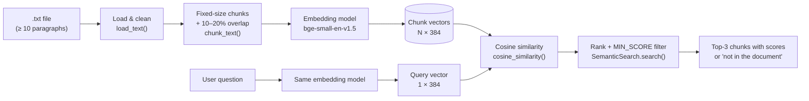

# Technical Documentation

This document describes how the semantic search pipeline works internally: the data flow, the algorithms, every configurable parameter, and the design decisions behind them.

## Contents
1. [Architecture](#1-architecture)
2. [Step 1: Loading the text](#2-step-1-loading-the-text)
3. [Step 2: Fixed-size chunking with overlap](#3-step-2-fixed-size-chunking-with-overlap)
4. [Step 3: Embedding](#4-step-3-embedding)
5. [Steps 4–6: Query embedding and cosine similarity](#5-steps-46-query-embedding-and-cosine-similarity)
6. [Step 7: Ranking and the confidence threshold](#6-step-7-ranking-and-the-confidence-threshold)
7. [Parameters](#7-parameters)
8. [Code reference](#8-code-reference)
9. [Testing](#9-testing)
10. [Limitations](#10-limitations)

---

## 1. Architecture

The project is a **bi-encoder retrieval** pipeline, the first stage of a Retrieval-Augmented Generation (RAG) system. Documents and queries are embedded **independently** by the same model, and relevance is measured with cosine similarity between their vectors.



Chunks are embedded **once** when the index is built. Each query costs only one embedding call plus one matrix–vector product, so searching stays fast as the number of questions grows.

## 2. Step 1: Loading the text

`load_text(path)` reads the file as UTF-8 and:

1. Splits paragraphs on **blank lines** (`\n\s*\n`). If the file has no blank lines, every non-empty line becomes a paragraph.
2. Normalises whitespace inside each paragraph (tabs, double spaces and line breaks become single spaces).
3. Joins all paragraphs with single spaces into one continuous `text`, which is what gets chunked.

Paragraphs are only used to validate the input (the assignment requires at least 10). The chunker works on the continuous text, so chunks may span paragraph boundaries. This is the expected behaviour of a fixed-size window.

## 3. Step 2: Fixed-size chunking with overlap

A window of `CHUNK_SIZE` units slides over the text. Each new window starts `step` units after the previous one:

```
overlap = round(CHUNK_SIZE × OVERLAP_PERCENT / 100)
step    = CHUNK_SIZE − overlap
```

Example (`CHUNK_SIZE = 800`, `OVERLAP_PERCENT = 15`):

```
overlap = 120,  step = 680

chunk 0: [   0 ...  800)
chunk 1: [ 680 ... 1480)      ← shares characters 680–800 with chunk 0
chunk 2: [1360 ... 2160)      ← shares characters 1360–1480 with chunk 1
...
last   : [start ... end of text)   (may be shorter than CHUNK_SIZE)
```

The loop stops as soon as a window reaches the end of the text, so the final chunk is never fully contained in the previous one.

**Number of chunks** for a text of length *L*:

```
chunks = 1                                   if L ≤ CHUNK_SIZE
chunks = ceil((L − CHUNK_SIZE) / step) + 1   otherwise
```

### Units: characters vs tokens

| `CHUNK_UNIT` | How the window is measured | Notes |
|---|---|---|
| `characters` (default) | String positions | Simple and predictable. Cuts can land in the middle of a word. |
| `tokens` | Positions in the model's tokenizer output | Matches how the model counts its input limit. The tokenizer's offset mapping converts token windows back into the exact original text. |

For `bge-small-en-v1.5`, one token ≈ 4 English characters, so 500 tokens ≈ 2,000 characters. Chunks must stay under the model's **512-token limit**; anything longer is silently truncated by the model.

### Why overlap?

A fact that falls on a boundary ("…signed the French striker | Karim Benzema…") would otherwise be split across two chunks and match poorly in both. With overlap, the boundary region appears in full in at least one chunk. The cost is a few extra chunks (see [EXPERIMENTS.md](EXPERIMENTS.md#2-overlap)). The implementation enforces the assignment's 10–20% range and raises a `ValueError` outside it.

## 4. Step 3: Embedding

Every chunk is encoded by a [Sentence-Transformers](https://www.sbert.net/) model into a dense vector.

| Property | `BAAI/bge-small-en-v1.5` (default) |
|---|---|
| Architecture | BERT-style transformer encoder (bi-encoder), CLS pooling |
| Parameters | ~33M |
| Vector size | 384 |
| Max input | 512 tokens |
| Language | English |

The output is a matrix `chunk_vectors` of shape `(number_of_chunks, 384)`.

Any Sentence-Transformers model can be used by changing `EMBEDDING_MODEL` / `--model`. For Arabic or mixed-language text, use a multilingual model such as `BAAI/bge-m3`. Scores differ between models, so `MIN_SCORE` must be re-calibrated after switching.

## 5. Steps 4–6: Query embedding and cosine similarity

The user's question is encoded by **the same model** into a 384-number vector. This is essential: vectors from different models live in different spaces and cannot be compared.

Relevance is measured with **cosine similarity**, implemented explicitly in `cosine_similarity()`:

$$
\text{cosine}(A, B) = \frac{A \cdot B}{\lVert A \rVert \, \lVert B \rVert}
$$

```python
dot_products = matrix @ query_vector                                    # A · B for every chunk
norms = np.linalg.norm(matrix, axis=1) * np.linalg.norm(query_vector)   # ‖A‖ × ‖B‖
scores = dot_products / norms
```

Cosine similarity compares the **direction** of two vectors and ignores their length, so a long chunk is not favoured just for containing more words. Scores range from −1 to 1. With this model, related texts typically score 0.6–0.85 and unrelated texts 0.35–0.6.

## 6. Step 7: Ranking and the confidence threshold

1. Chunks are sorted by score, highest first (`np.argsort(scores)[::-1]`).
2. The first `TOP_K` (default 3) are kept.
3. Any of those scoring below `MIN_SCORE` (default 0.6) are removed.
4. If none remain, the system answers **"This is not in the document you provided."** instead of returning irrelevant chunks.

Without step 3, nearest-neighbour search *always* returns something, even for questions unrelated to the document. The threshold of 0.6 was chosen by calibration: questions answered in the text against questions that are not. With 800-character chunks it classifies 88% of the test questions correctly (see [EXPERIMENTS.md](EXPERIMENTS.md#3-confidence-threshold-calibration)).

## 7. Parameters

| Parameter | Notebook | CLI flag | Default | Effect of increasing it |
|---|---|---|---|---|
| `CHUNK_SIZE` | Settings cell | `--chunk-size` | 800 | Fewer, larger chunks. More context per answer and better for broad questions; specific facts get diluted. |
| `OVERLAP_PERCENT` | Settings cell | `--overlap` | 15 | More shared text between neighbours, so fewer facts are split at boundaries; slightly more chunks. Must be 10–20. |
| `CHUNK_UNIT` | Settings cell | `--unit` | `characters` | `tokens` measures size the way the model does. |
| `EMBEDDING_MODEL` | Settings cell | `--model` | `BAAI/bge-small-en-v1.5` | Larger models are usually more accurate but slower. Changing it requires re-calibrating `MIN_SCORE`. |
| `TOP_K` | Settings cell | `--top-k` | 3 | More chunks returned, so a broad answer is less likely to be missed, but more noise. |
| `MIN_SCORE` | Settings cell | `--min-score` | 0.6 | Stricter: off-topic questions are rejected more reliably, but some real answers are cut. |

After changing a setting in the notebook, re-run the settings cell and every cell after the chunking step.

## 8. Code reference

All logic lives in [`src/semantic_search.py`](../src/semantic_search.py). The Colab notebook implements the same steps cell by cell.

| Function / class | Purpose |
|---|---|
| `load_text(path) -> (text, paragraphs)` | Read and clean the input file |
| `overlap_size(chunk_size, overlap_percent) -> int` | Compute the overlap and validate the 10–20% range |
| `sliding_windows(length, size, step) -> [(start, end)]` | Window positions over a sequence |
| `chunk_text(text, chunk_size, overlap_percent, unit, tokenizer) -> [str]` | Fixed-size chunking by characters or tokens |
| `cosine_similarity(query_vector, matrix) -> np.ndarray` | Cosine similarity of one vector with every row |
| `SemanticSearch(chunks, model_name \| model)` | Embeds the chunks once and stores the vectors |
| `SemanticSearch.scores(question)` | Similarity of a question with every chunk |
| `SemanticSearch.search(question, top_k, min_score) -> [SearchResult]` | Ranked, threshold-filtered results |
| `format_results(question, results, min_score) -> str` | Question / Answers text output |
| `main(argv)` | Command-line interface |

`SemanticSearch` accepts any object with an `encode()` method, which makes it testable with a lightweight fake model and no download.

## 9. Testing

```bash
pip install -r requirements-dev.txt
pytest
```

The [test suite](../tests/test_pipeline.py) covers:
- paragraph splitting and the line-based fallback
- overlap size and rejection of values outside 10–20%
- window positions, fixed chunk sizes, shared overlap between neighbours, and lossless reconstruction of the original text from the chunks
- cosine similarity against hand-computed values and independence from vector length
- ranking order and the "not in the document" behaviour (using a fake embedding model)

Tests run automatically on every push and pull request through [GitHub Actions](../.github/workflows/tests.yml).

## 10. Limitations

- **Similarity is not completeness.** Top-k search returns the most *similar* chunks, not *every* relevant chunk. Questions like "how many…" or "list all…" can miss parts of the answer when it is spread across many chunks. Larger chunks or a higher `TOP_K` help.
- **Retrieval only.** The system returns passages; it does not generate a written answer. Adding an LLM on top of these chunks is the generation step of RAG.
- **The threshold is model- and data-specific.** 0.6 was calibrated for `bge-small-en-v1.5` on English text and must be re-checked for other models or documents.
- **Same-topic questions are the hardest to reject.** A football question that the text doesn't answer ("Who won the 2022 World Cup?") can score close to real answers.
- **Character windows cut words.** Chunks can start or end mid-word; the overlap compensates for this at the boundaries.
- **English model.** The default model is English-only; use a multilingual model for Arabic text.
