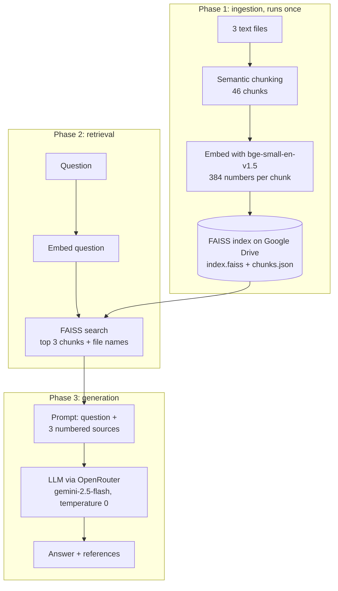
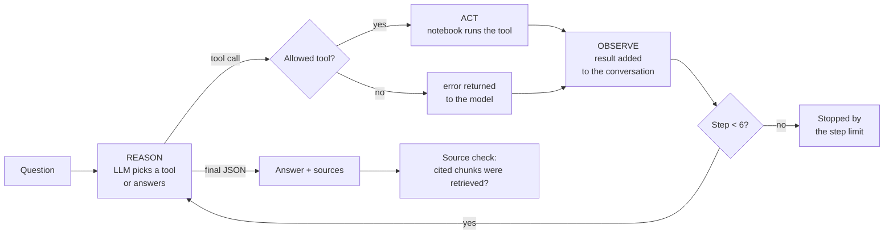

# Final Project: RAG Pipeline with a Research Agent


A complete Retrieval-Augmented Generation (RAG) system over three documents from different fields. It extends [Assignment 2](../assignment-2-semantic-faiss/) with an LLM that writes the answer from the retrieved chunks, and adds a research agent that decides for itself which tools to call. The agent runs inside guardrails that limit its steps, allow only two tools, and check that every source it cites was actually retrieved.

Part of the **Generative AI Solutions Development** program at [SDAIA Academy](https://github.com/SDAIAAcademy). See the [repository overview](../README.md) for the full list of projects.

## Contents

- [How it works](#how-it-works)
- [Getting started](#getting-started)
- [Configuration](#configuration)
- [The research agent](#the-research-agent)
- [Guardrails](#guardrails)
- [Results](#results)
- [What changed from Assignment 2](#what-changed-from-assignment-2)
- [Folder structure](#folder-structure)
- [Limitations](#limitations)
- [Arabic summary](#arabic-summary)

## How it works



| Phase | Cells | What happens |
|---|---|---|
| 1. Ingestion | 1-7 | Load the three documents, split them into 46 chunks by meaning, embed them, and save a FAISS index to Google Drive. Summaries of the three documents are stored in a second index. On later runs the saved database is found and this phase is skipped |
| 2. Retrieval | 8-14 | Embed the question with the same model and return the top 3 chunks with their similarity score and file name. Includes summary-first search, a FAISS versus cosine-formula comparison, a chart of scores per file, and a question loop |
| 3. Generation | 16-17 | Connect to OpenRouter, build a prompt from the question and the 3 numbered chunks, and ask the LLM to answer only from those sources. The answer is printed with the files and chunks it used |
| Agent | 18-20 | Give the LLM two tools (document search and a calculator) and let it plan its own steps in a ReAct loop, inside guardrails. A final cell runs a fixed test set through both the RAG answer and the agent |

The full cell-by-cell description is in the [technical documentation](docs/TECHNICAL_DOCUMENTATION.md).

## Getting started

1. Get an API key from [OpenRouter](https://openrouter.ai/) and add it to Colab Secrets (the key icon in the left panel) as `OPENROUTER_API_KEY`, with notebook access enabled.
2. Open [Google Colab](https://colab.research.google.com/) and upload [`notebooks/rag_research_agent_colab.ipynb`](notebooks/rag_research_agent_colab.ipynb).
3. Upload the three documents from [`data/`](data/) and the three summaries from [`data/summaries/`](data/summaries/) to the Colab Files panel.
4. Run all cells and allow access to Google Drive when asked. Type a question at each prompt.

The vector database is saved to `MyDrive/assignment2_vector_db/`, the same location as Assignment 2. If that database already exists with the same settings, it is reused and no files need to be uploaded.

A plain Python export of the notebook is in [`notebooks/rag_research_agent_colab.py`](notebooks/rag_research_agent_colab.py). It contains the same code and is meant to be read or run in Colab.

## Configuration

| Setting | Value | Description |
|---|---|---|
| `FILES` | 3 files | The documents to index |
| `EMBEDDING_MODEL` | `BAAI/bge-small-en-v1.5` | Used for sentences, chunks, summaries and questions |
| `SEMANTIC_PERCENTILE` | `10` | Inside a paragraph, cut where sentence-to-sentence similarity is in the lowest 10% for that file |
| `MAX_CHUNK_CHARS` | `1000` | Maximum chunk length |
| `TOP_K` | `3` | Number of chunks retrieved and passed to the LLM |
| `USE_GOOGLE_DRIVE` | `True` | Save the database to Google Drive so it survives Colab restarts |
| `REBUILD` | `False` | Set to `True` to rebuild the database from the text files |
| `LLM_MODEL` | `google/gemini-2.5-flash` | Any OpenRouter model that supports tool calling |
| `temperature` | `0` | The same question gets the same answer, with no creative variation |
| `MAX_AGENT_STEPS` | `6` | Maximum number of reason and act rounds for the agent |

## The research agent

The agent is the LLM with two tools. It reads the question, decides which tool to call, reads the result, and repeats until it can answer. This is the ReAct pattern (reason, act, observe).



| Tool | What it does |
|---|---|
| `search_documents(query)` | Searches the FAISS database and returns the top 3 chunks with chunk id, file, score and text. Read-only: the agent cannot change the database |
| `calculator(expression)` | Evaluates arithmetic such as `1957 - 1927`. Only numbers and `+ - * / ** ( )` are accepted, so no code can run |

The LLM never runs anything itself. It only asks for a tool by name; the notebook checks the name and runs the matching Python function.

## Guardrails

| Guardrail | Where | What it prevents |
|---|---|---|
| Answer only from sources | `RAG_SYSTEM_PROMPT`, `AGENT_SYSTEM_PROMPT` | Answers from the model's own knowledge. If the documents don't contain the answer, the model must say so with no sources |
| Valid references only | `rag_answer` | Only source numbers 1 to 3 are accepted as references |
| Allowed tools only | `run_agent` | Any tool name other than `search_documents` and `calculator` is blocked and reported |
| Step limit | `MAX_AGENT_STEPS = 6` | Endless loops and runaway API costs. The agent stops and says so |
| Errors go back to the model | `run_agent` | A failing tool call doesn't crash the notebook. The error is sent to the model so it can try again |
| Safe calculator | `calculator` | Running code through the calculator. Only arithmetic is parsed, and exponents above 100 are refused |
| Source check | `run_agent` | Invented citations. Every chunk the agent cites must be one it retrieved in this run |
| Read-only search | `search_documents` | Changes to the database. The tool can only read |

After every agent run, the notebook prints a guardrail report with a check mark or a cross for the step limit, the allowed tools, and the source check.

## Results

The answers written by the LLM depend on the model and are not reproduced here. The results below come from the parts of the notebook that are deterministic: the vector database, the retrieval, and the tools.

**Ingestion** (same pipeline and data as Assignment 2)

| File | Paragraphs | Chunks | Cut threshold |
|---|---|---|---|
| football_clubs.txt | 10 | 15 | 0.499 |
| solar_system.txt | 12 | 15 | 0.542 |
| coffee.txt | 12 | 16 | 0.513 |

46 chunks are stored as 46 vectors of 384 numbers, and 3 summaries as a second index.

**Retrieval: the chunks passed to the LLM**

| Question | Top 3 chunks (file, chunk, score) |
|---|---|
| Which club signed Karim Benzema? | football_clubs.txt: chunk 4 (0.7685), chunk 1 (0.6805), chunk 12 (0.6771) |
| Where is Khawlani coffee grown? | coffee.txt: chunk 45 (0.7797), then 0.6486 and 0.6408 |
| Which planet is the hottest? | solar_system.txt: chunk 19 (0.8703), then 0.7401 and 0.6883 |
| What is the capital of France? | football_clubs.txt: chunk 7 (0.5719), not relevant. The prompt tells the LLM to answer that the documents do not contain this information |

The FAISS scores are identical to the cosine formula `(A · B) / (‖A‖ × ‖B‖)` computed by hand.

**Agent tool steps**

The agent test questions each need two facts from the documents and one calculation. The tool results the agent receives are:

| Question | Tool call | Result |
|---|---|---|
| How many years after Al Ittihad was Al Hilal founded? | `search_documents("When was Al Ittihad founded?")` | chunk 3, football_clubs.txt (0.79): founded in 1927 |
| | `search_documents("When was Al Hilal founded?")` | chunk 0, football_clubs.txt (0.80): founded in 1957 |
| | `calculator("1957 - 1927")` | 30 |
| How much hotter is Venus than the daytime temperature on Mercury? | `search_documents` for Venus | chunk 19, solar_system.txt (0.81): about 465 °C |
| | `search_documents` for Mercury | chunk 17, solar_system.txt (0.84): about 430 °C |
| | `calculator("465 - 430")` | 35 |

The exact search wording is chosen by the LLM, so it can differ between runs.

**Guardrail behaviour**

Each guardrail was tested by replacing `call_llm` with a scripted model that misbehaves on purpose:

| Misbehaviour | Result |
|---|---|
| Calls a tool named `delete_files` | Blocked. The report shows "only allowed tools were called" with a cross and lists the blocked tool |
| Cites chunk 44, which it never retrieved | The source check shows a cross and lists chunk 44 as not retrieved |
| Keeps calling tools and never answers | Stopped after 6 of 6 steps, with the answer "Stopped after 6 steps without a final answer." |
| Sends code or `2**1000` to the calculator | Refused with an error that is returned to the model |

## What changed from Assignment 2

| | [Assignment 2](../assignment-2-semantic-faiss/) | Final project |
|---|---|---|
| Output | Top 3 chunks with scores and files | A written answer from the LLM, with the files and chunks it used |
| LLM | None | `google/gemini-2.5-flash` through OpenRouter, temperature 0 |
| Questions needing several facts | One search, one set of chunks | The agent searches once per fact and calculates with a tool |
| Unrelated questions | Still returns the 3 closest chunks | The LLM says the documents do not contain the answer |
| Safety | Not needed for retrieval only | Step limit, allowed tools, safe calculator, source check |
| Check cells | 27 automated checks | Not included; the retrieval pipeline is the same code as Assignment 2 |

Cells 1 to 14 are the same code as Assignment 2, without its check cells.

## Folder structure

```
final-project-rag-agent/
├── notebooks/
│   ├── rag_research_agent_colab.ipynb   # The final project notebook
│   └── rag_research_agent_colab.py      # The same code as a Python file
├── data/
│   ├── football_clubs.txt               # 10 paragraphs
│   ├── solar_system.txt                 # 12 paragraphs
│   ├── coffee.txt                       # 12 paragraphs
│   └── summaries/                       # One summary per document
├── docs/
│   └── TECHNICAL_DOCUMENTATION.md       # Cell-by-cell description and design
├── requirements.txt
└── README.md
```

## Limitations

- **"Answer only from sources" is an instruction.** Nothing checks every sentence of the answer against the chunks. The source check confirms only that the cited chunks were retrieved.
- **No minimum similarity score.** Unrelated questions still retrieve 3 chunks, and the LLM is relied on to say the answer is not there.
- **One agent.** There is no separate reviewer agent that checks the draft answer.
- **No input filter.** Prompt injection in the question is not detected.
- **English model.** Arabic documents need a multilingual embedding model such as `BAAI/bge-m3`.

## Arabic summary

المشروع النهائي ضمن دورة **تطوير حلول الذكاء الاصطناعي التوليدي** في [أكاديمية سدايا](https://github.com/SDAIAAcademy).

يبني المشروع نظام RAG كاملاً فوق المشروع الثاني: تُقسَّم ثلاثة مستندات حسب المعنى وتُحفظ متجهاتها في قاعدة بيانات FAISS على Google Drive، ثم تُسترجع أفضل ثلاثة أجزاء لكل سؤال وتُرسل مع السؤال إلى نموذج لغوي (`gemini-2.5-flash` عبر OpenRouter) ليكتب الإجابة من هذه المصادر فقط مع ذكر المراجع. ويضيف المشروع وكيلاً بحثياً بنمط ReAct يملك أداتين: البحث في المستندات والآلة الحاسبة، فيبحث عن كل معلومة على حدة ثم يحسب الناتج. ويعمل الوكيل ضمن ضوابط أمان: حد أقصى ست خطوات، وأدوات مسموحة فقط، وآلة حاسبة آمنة، والتحقق من أن كل مصدر يذكره قد استُرجع فعلاً.
