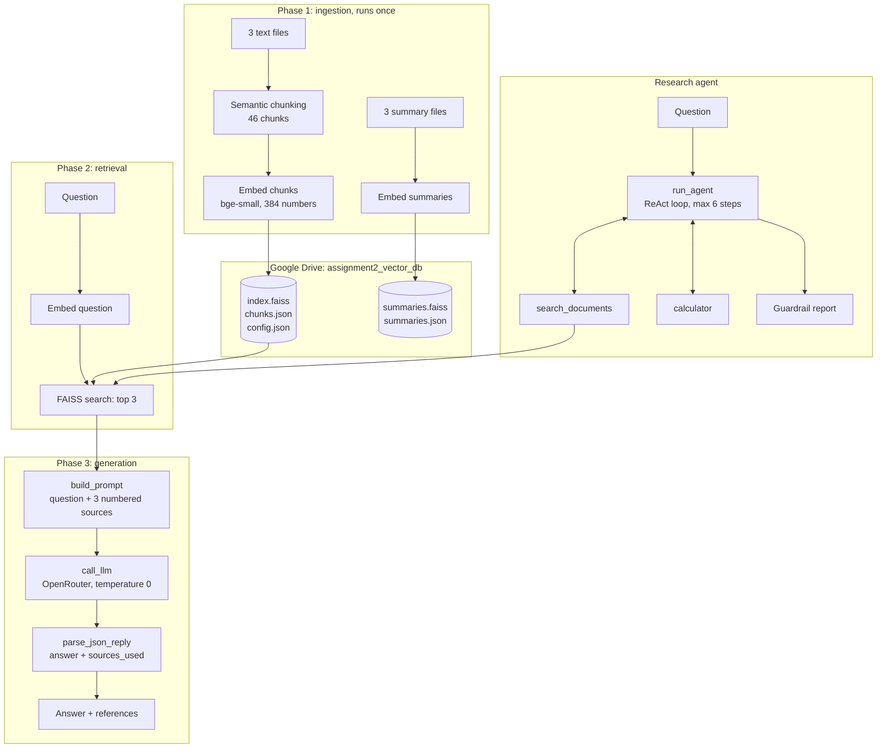

# Technical Documentation: Final Project

This document describes how [`notebooks/rag_research_agent_colab.ipynb`](../notebooks/rag_research_agent_colab.ipynb) works: what each cell does, how the LLM is connected, how the prompt is built, how the research agent runs, and how the guardrails work. Cells 1 to 14 are the retrieval pipeline from Assignment 2; their algorithms (semantic chunking, the FAISS index, saving and reusing the database) are described in detail in the [Assignment 2 documentation](../../assignment-2-semantic-faiss/docs/TECHNICAL_DOCUMENTATION.md).

## Contents
1. [Architecture](#1-architecture)
2. [Cell-by-cell description](#2-cell-by-cell-description)
3. [Connecting to the LLM](#3-connecting-to-the-llm)
4. [Phase 3: answer generation](#4-phase-3-answer-generation)
5. [The research agent](#5-the-research-agent)
6. [Guardrails](#6-guardrails)
7. [Test set](#7-test-set)
8. [Limitations](#8-limitations)

---

## 1. Architecture



`rag_answer` always retrieves once and asks the LLM once. `run_agent` lets the LLM decide how many searches and calculations it needs, up to 6 rounds.

## 2. Cell-by-cell description

| Cell | Purpose |
|---|---|
| 1 | **Settings:** files, embedding model, `SEMANTIC_PERCENTILE`, `MAX_CHUNK_CHARS`, `TOP_K`, storage location and `REBUILD` |
| 2 | Installs `sentence-transformers` and `faiss-cpu` |
| 3 | **Setup:** imports, mounts Google Drive, loads the embedding model, defines the database paths, and sets `NEED_INGESTION` by comparing the saved `config.json` with the current settings |
| 4 | **Load** (ingestion): uploads missing files and splits each file into paragraphs |
| 5 | **Semantic chunking** (ingestion): splits paragraphs into sentences, embeds them, and cuts where the meaning changes |
| 6 | **Summaries:** embeds the three summary files and stores them in a second FAISS index |
| 7 | **Embed and store** (ingestion): embeds the chunks, normalises them, builds the FAISS `IndexFlatIP` and saves it to Drive |
| 8 | **Load the database:** reads the index and chunk list from Drive |
| 9 | Defines `cosine_similarity()` |
| 10 | **Summary-first search:** picks the closest file by its summary, then returns the top 3 chunks of that file |
| 11 | Defines `search()` and `print_answers()` and answers one typed question with the top 3 chunks |
| 12 | Compares the FAISS scores with the cosine formula for the same question |
| 13 | Plots the similarity of every chunk, grouped by file |
| 14 | Question loop: keeps asking until the input is empty |
| 15 | Markdown: "Agent starts" |
| 16 | **LLM connection:** `call_llm()` sends messages to OpenRouter, `parse_json_reply()` reads the model's JSON, and a test call prints "LLM connected" |
| 17 | **Phase 3:** `RAG_SYSTEM_PROMPT`, `build_prompt()` and `rag_answer()`, then answers one typed question and shows the full prompt sent to the LLM |
| 18 | **Agent tools:** `search_documents()`, the safe `calculator()`, the `AGENT_TOOLS` dictionary and the tool schemas sent to the LLM. Prints `Test: 30 \| football_clubs.txt` |
| 19 | **Agent:** `AGENT_SYSTEM_PROMPT`, `MAX_AGENT_STEPS = 6` and `run_agent()`, then runs the agent on one typed question |
| 20 | **Test set:** runs 4 questions through `rag_answer()` and 2 through `run_agent()` and shows the results as a table |

## 3. Connecting to the LLM

The notebook calls OpenRouter's chat completions endpoint directly with `requests`:

| Item | Value |
|---|---|
| Endpoint | `https://openrouter.ai/api/v1/chat/completions` |
| API key | Read from Colab Secrets with `userdata.get('OPENROUTER_API_KEY')`, never written in the notebook |
| Model | `google/gemini-2.5-flash` (`LLM_MODEL`) |
| Temperature | `0`, so the answer is consistent for the same prompt |
| Timeout | 120 seconds |

`call_llm(messages, tools=None, temperature=0)` returns the model's reply message. When `tools` is given, the request includes the tool schemas, and the reply may contain `tool_calls` instead of text. Any response other than HTTP 200 raises an error with the status code and the first 300 characters of the response.

`parse_json_reply(text)` extracts the JSON object the model was asked to return, including when it is wrapped in a ```` ```json ```` fence. If no valid JSON is found, the whole text is used as the answer and any `[1]`, `[2]` markers are read as the sources.

## 4. Phase 3: answer generation

`rag_answer(question)` runs the three steps of Phase 3:

| Step | Function | What happens |
|---|---|---|
| 3.1 Context assembly | `build_prompt` | The question is followed by the 3 retrieved chunks, numbered `[1]` to `[3]`, each with its file name, chunk id and similarity score |
| 3.2 Inference | `call_llm` | The system prompt and the assembled prompt are sent to the LLM |
| 3.3 Output | `rag_answer` | The answer is printed with the references the model used (file, chunk, score) and the retrieved chunks it did not use |

The prompt sent to the LLM has this shape:

```
Question: <question>

Sources:
[1] (file: <file>, chunk <id>, similarity <score>)
<chunk text>

[2] ...

[3] ...
```

The system prompt (`RAG_SYSTEM_PROMPT`) tells the model to:
- use only the numbered sources and no outside knowledge;
- answer "The provided documents do not contain this information." with no sources when the answer is not in the sources;
- keep the answer short;
- return only `{"answer": "...", "sources_used": [...]}`.

Only source numbers between 1 and 3 are accepted from `sources_used`; anything else is ignored.

## 5. The research agent

### Tools

| Tool | Function | Input | Output |
|---|---|---|---|
| `search_documents` | Runs `search()` on the FAISS index | `query` (plain English) | The top 3 chunks as `chunk_id`, `file`, `score` (4 decimals) and `text` |
| `calculator` | Evaluates arithmetic with Python's `ast` module | `expression` such as `"1957 - 1927"` | The number |

Each tool is described to the LLM in `AGENT_TOOL_SCHEMAS` (OpenAI function-calling format, which OpenRouter accepts): a name, a description of when to use it, and the parameters it takes. The model only sees these descriptions; `AGENT_TOOLS` maps each allowed name to the Python function that runs it.

### The ReAct loop

`run_agent(question, max_steps=6)` starts the conversation with `AGENT_SYSTEM_PROMPT` and the question, then repeats:

1. **Reason.** `call_llm` is sent the conversation and the tool schemas. The model either asks for one or more tools, or gives its final answer.
2. **Act.** For each tool call, the notebook reads the arguments, checks that the tool is allowed, and runs it.
3. **Observe.** The tool result is added to the conversation as a `tool` message, linked to the call by its id.

The loop ends when the model replies without a tool call (its final answer, read with `parse_json_reply`) or when the step limit is reached.

Each step is printed, for example:

```
Step 1 | search_documents(query='When was Al Ittihad founded?') -> chunk 3 (football_clubs.txt, 0.79), ...
Step 2 | search_documents(query='When was Al Hilal founded?') -> chunk 0 (football_clubs.txt, 0.80), ...
Step 3 | calculator(expression='1957 - 1927') -> 30
```

The step number, tool names and arguments depend on the model's decisions; the tool results shown are what the tools return for these arguments.

`run_agent` returns a dictionary with `question`, `answer`, `sources`, `steps`, `finished` and `grounded`.

## 6. Guardrails

| Guardrail | Implementation |
|---|---|
| Answer only from sources | Rules in `RAG_SYSTEM_PROMPT` and `AGENT_SYSTEM_PROMPT`, with a fixed answer when the documents don't contain the information |
| Valid references only | `rag_answer` keeps only `sources_used` values that are numbers from 1 to `len(retrieved)` |
| Allowed tools only | A tool name not in `AGENT_TOOLS` is added to `unknown_tools` and an error is returned instead of running anything |
| Step limit | The loop runs at most `MAX_AGENT_STEPS` (6) times. Without a final answer, the result is "Stopped after 6 steps without a final answer." and `finished` is `False` |
| Errors go back to the model | Every tool call is wrapped in `try` / `except`; the error message becomes the tool result, so the model can correct itself |
| Safe calculator | The expression is parsed into a syntax tree and only numbers and `+ - * / ** ( )` and negative signs are evaluated. Names, function calls and attribute access raise an error. Exponents above 100 are refused, so `2**1000` cannot be used to stall the notebook |
| Source check | `retrieved_ids` collects every chunk id returned by `search_documents` in this run. `grounded` is `True` only if every cited chunk is in that set |
| Read-only search | `search_documents` only reads `index` and `chunk_records` |

After each run, the guardrail report prints a check mark or a cross for:
- the number of steps used out of 6 (and whether the step limit stopped the agent);
- whether only allowed tools were called (with any blocked names);
- whether every cited chunk was retrieved in this run (with any that were not).

### Testing the guardrails

The guardrails were tested by replacing `call_llm` with a scripted model that misbehaves on purpose, then running `run_agent`:

| Scripted behaviour | Guardrail result |
|---|---|
| Requests a tool named `delete_files` | Blocked and listed in the report |
| Cites chunk 44 without retrieving it | `grounded` is `False`; chunk 44 is listed as not retrieved |
| Requests a tool on every step | Stopped after 6 steps, `finished` is `False` |
| Sends Python code, then `2**1000`, to the calculator | Both refused with an error returned to the model |

## 7. Test set

Cell 20 runs a fixed set of questions and collects the results in a pandas table with the columns `type`, `question`, `answer` and `sources`.

| Type | Question | What it tests |
|---|---|---|
| RAG | Which club signed Karim Benzema? | A fact from football_clubs.txt (top chunk 4, score 0.7685) |
| RAG | Where is Khawlani coffee grown? | A fact from coffee.txt (top chunk 45, score 0.7797) |
| RAG | Which planet is the hottest? | A fact from solar_system.txt (top chunk 19, score 0.8703) |
| RAG | What is the capital of France? | A question the documents can't answer (best score only 0.5719) |
| Agent | How many years after Al Ittihad was Al Hilal founded? | Two searches (1927 and 1957) and a calculation (30) |
| Agent | How much hotter is Venus than the daytime temperature on Mercury? | Two searches (465 °C and 430 °C) and a calculation (35) |

The retrieval scores are deterministic. The answer text comes from the LLM and is not reproduced in this documentation.

## 8. Limitations

- The "answer only from sources" rule is an instruction to the model; no step checks each sentence of the answer against the chunks.
- There is no minimum similarity score, so unrelated questions still send 3 chunks to the LLM.
- The source check confirms that cited chunks were retrieved, not that they support the answer.
- A single agent writes the answer; there is no reviewer agent.
- The question is not filtered for prompt injection.
- The embedding model is English-only.
